# HwameiStor 程序入口与启动流程

## 入口文件总览

HwameiStor 包含 11 个独立的可执行模块，每个模块都有自己的 `main()` 函数入口。

### 入口文件列表

| 模块 | 入口文件 | 主要框架 | 服务类型 |
|------|---------|---------|---------|
| **Local Disk Manager (LDM)** | [cmd/local-disk-manager/diskmanager.go](../../cmd/local-disk-manager/diskmanager.go) | controller-runtime | Controller + CSI Driver |
| **Local Storage (LS)** | [cmd/local-storage/storage.go](../../cmd/local-storage/storage.go) | controller-runtime | Controller + CSI Driver + HTTP |
| **Scheduler** | [cmd/scheduler/scheduler.go](../../cmd/scheduler/scheduler.go) | kube-scheduler | Scheduler Plugin |
| **Admission Controller** | [cmd/admission/admission.go](../../cmd/admission/admission.go) | net/http | HTTPS Webhook Server |
| **Evictor** | [cmd/evictor/main.go](../../cmd/evictor/main.go) | controller-runtime | Controller (Leader Election) |
| **Exporter** | [cmd/exporter/main.go](../../cmd/exporter/main.go) | Prometheus | Metrics Collector |
| **API Server** | [cmd/apiserver/main.go](../../cmd/apiserver/main.go) | Gin | HTTP REST API |
| **Failover Assistant** | [cmd/failover-assistant/main.go](../../cmd/failover-assistant/main.go) | controller-runtime | Controller (Leader Election) |
| **Auditor** | [cmd/auditor/main.go](../../cmd/auditor/main.go) | controller-runtime | Controller (Leader Election) |
| **PVC AutoResizer** | [cmd/pvc-autoresizer/main.go](../../cmd/pvc-autoresizer/main.go) | controller-runtime | Controller + Informer |
| **Local Disk Action Controller** | [cmd/local-disk-action-controller/main.go](../../cmd/local-disk-action-controller/main.go) | Informer | Controller |
| **hwameictl (CLI)** | [cmd/hwameictl/hwameictl.go](../../cmd/hwameictl/hwameictl.go) | Cobra | CLI Tool |

---

## 模块启动流程详解

### 1. Local Disk Manager (LDM)

**入口**: [cmd/local-disk-manager/diskmanager.go:58](../../cmd/local-disk-manager/diskmanager.go#L58)

#### 启动流程

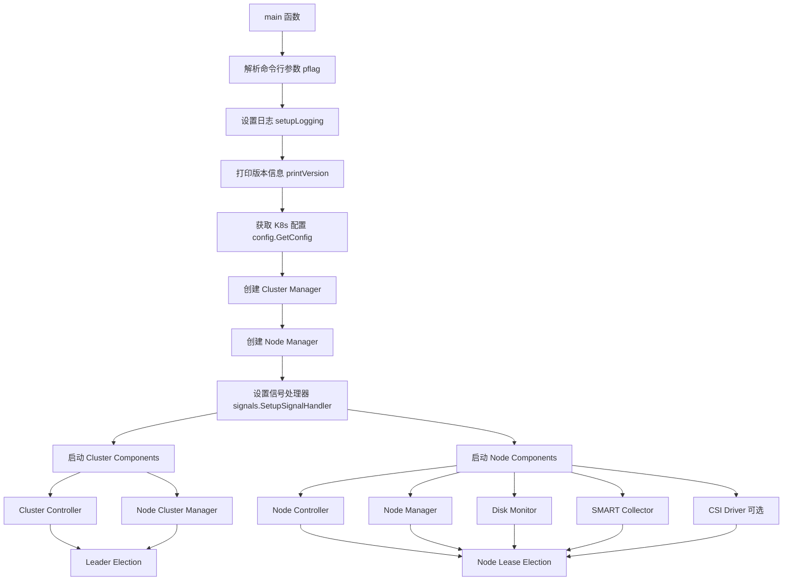

#### 关键组件初始化

1. **Cluster Manager** ([diskmanager.go:326](../../cmd/local-disk-manager/diskmanager.go#L326))
   - 创建 controller-runtime Manager
   - 注册 CRD Scheme (`v1alpha1.AddToScheme`)
   - 设置 Cache 索引字段 (`setIndexField`)
   - 添加所有 Controller (`controller.AddToManager`)

2. **Node Manager** ([diskmanager.go:357](../../cmd/local-disk-manager/diskmanager.go#L357))
   - 创建独立的 Manager 实例
   - 注册 Node 级别的 Controllers

3. **Node Components** ([diskmanager.go:131](../../cmd/local-disk-manager/diskmanager.go#L131))
   - Node Controller: 管理节点级别 CR
   - Node Manager: 磁盘发现和管理
   - Disk Monitor: 实时监控磁盘变化
   - SMART Collector: 每 6 小时采集 SMART 数据
   - CSI Driver: 可选的 CSI 驱动 (通过 `--csi-enable` 启用)

#### 命令行参数

```bash
--endpoint          # CSI endpoint (默认: unix://csi/csi.sock)
--drivername        # CSI driver 名称 (默认: disk.hwameistor.io)
--nodeid            # 节点 ID (必须)
--csi-enable        # 启用 CSI Driver (默认: false)
--v                 # 日志级别 (默认: 4)
```

---

### 2. Local Storage (LS)

**入口**: [cmd/local-storage/storage.go:86](../../cmd/local-storage/storage.go#L86)

#### 启动流程

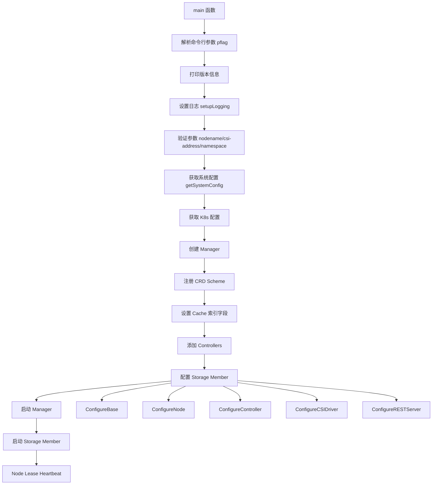

#### 关键组件

1. **Storage Member** ([storage.go:166](../../cmd/local-storage/storage.go#L166))
   ```go
   storageMember := member.Member().
       ConfigureBase(nodeName, namespace, systemConfig, pvMetadataSize, client, cache, recorder).
       ConfigureNode(scheme).
       ConfigureController(scheme).
       ConfigureCSIDriver(csiDriverName, csiSockAddr).
       ConfigureRESTServer(httpPort)
   ```

2. **System Config** ([storage.go:226](../../cmd/local-storage/storage.go#L226))
   - 支持 DRBD 模式（HA 卷）
   - 配置 DRBD 端口范围
   - 数据同步工具（JuiceSync）

#### 命令行参数

```bash
--nodename                   # 节点名称 (必须)
--namespace                  # Pod 命名空间 (必须)
--csi-address                # CSI endpoint (必须)
--system-mode                # 系统模式 (默认: drbd)
--data-sync-tool             # 数据同步工具 (默认: juicesync)
--drbd-start-port            # DRBD 起始端口 (默认: 43001)
--max-ha-volume-count        # 最大 HA 卷数量 (默认: 1000)
--http-port                  # REST 服务端口 (默认: 80)
--max-migrate-count          # 最大并发迁移数 (默认: 1)
--migrate-check              # 启用迁移数据校验 (默认: false)
--snapshot-restore-timeout   # 快照恢复超时 (默认: 600s)
--pv-metadata-size           # PV 元数据大小 (默认: 4MB)
--v                          # 日志级别 (默认: 4)
```

---

### 3. Scheduler

**入口**: [cmd/scheduler/scheduler.go:15](../../cmd/scheduler/scheduler.go#L15)

#### 启动流程

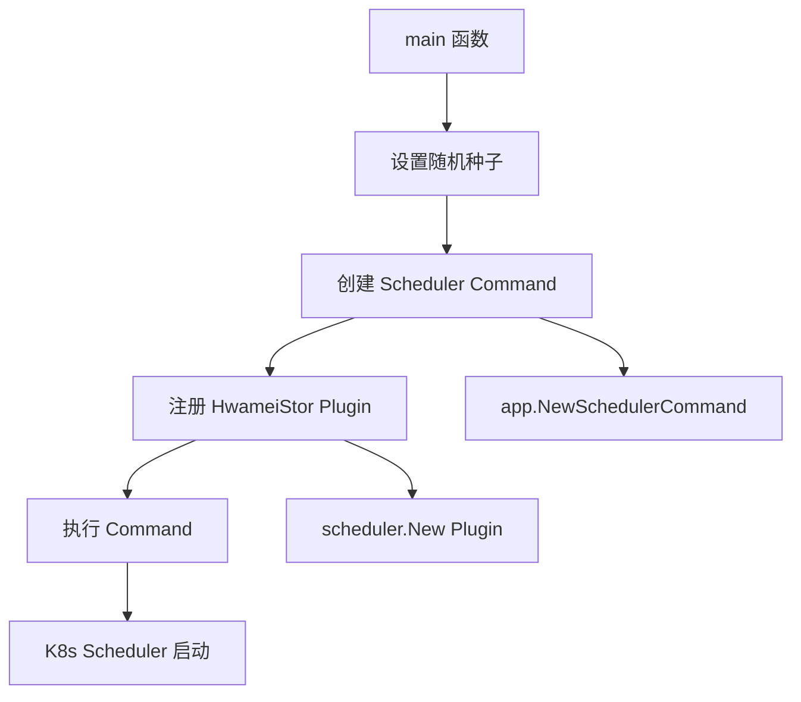

#### 关键特性

- 基于 Kubernetes Scheduler 框架
- 注册自定义调度插件 `scheduler.New`
- 插件名称: 通过 `scheduler.Name` 定义

**备注**: Scheduler 使用 Kubernetes 原生调度器框架，所有配置通过 Kubernetes Scheduler 配置文件传递。

---

### 4. Admission Controller

**入口**: [cmd/admission/admission.go:23](../../cmd/admission/admission.go#L23)

#### 启动流程

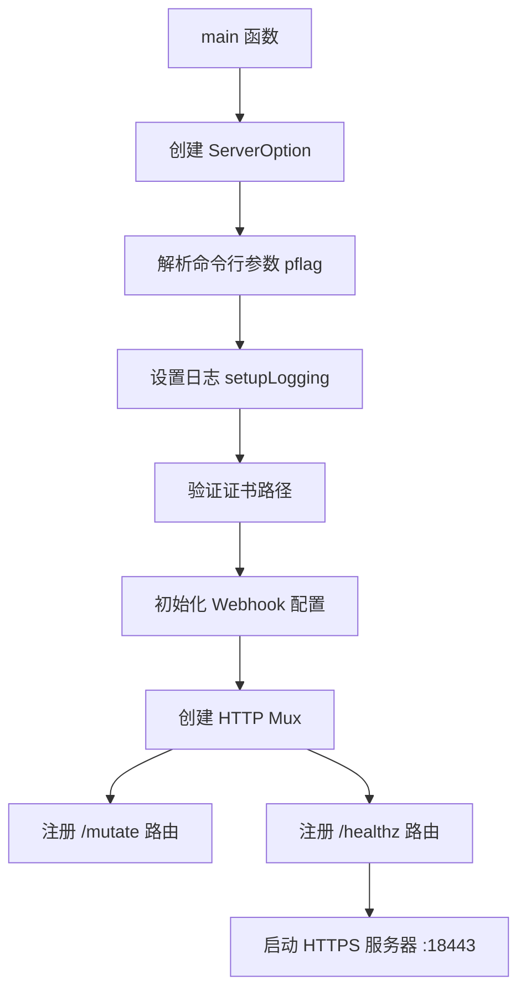

#### 关键组件

1. **Webhook 配置** ([admission.go:37](../../cmd/admission/admission.go#L37))
   - `hookcfg.CreateOrUpdateWebHookConfig()` 初始化 Webhook 配置

2. **路由注册**
   - `/mutate`: Mutating Webhook 入口 ([app.RegisterHwameiStorMutateWebhooks](../../cmd/admission/app/mutate.go))
   - `/healthz`: 健康检查入口

#### 命令行参数

```bash
--cert-dir              # 证书目录
--tls-cert-file         # TLS 证书文件名
--tls-private-key-file  # TLS 私钥文件名
--v                     # 日志级别 (默认: 4)
```

**服务端口**: `:18443` (固定)

---

### 5. Evictor

**入口**: [cmd/evictor/main.go:25](../../cmd/evictor/main.go#L25)

#### 启动流程

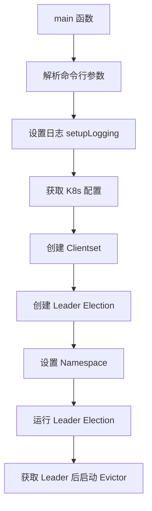

#### 关键特性

- **Leader Election**: 使用 `csi-lib-utils/leaderelection`
- **Lock Name**: `hwameistor-volume-evictor`
- **功能**: 处理节点驱逐场景下的卷副本迁移

---

### 6. Exporter

**入口**: [cmd/exporter/main.go:16](../../cmd/exporter/main.go#L16)

#### 启动流程

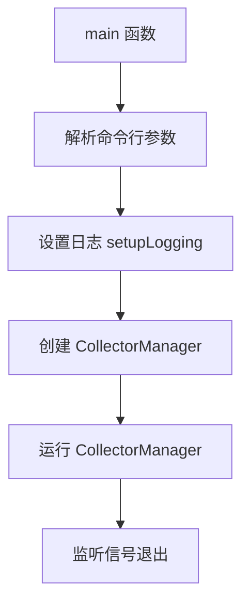

#### 关键特性

- **极简启动**: 仅需创建 `CollectorManager` 并运行
- **指标采集**: 暴露 Prometheus 指标 (节点、存储池、卷、磁盘)

---

### 7. API Server

**入口**: [cmd/apiserver/main.go:18](../../cmd/apiserver/main.go#L18)

#### 启动流程

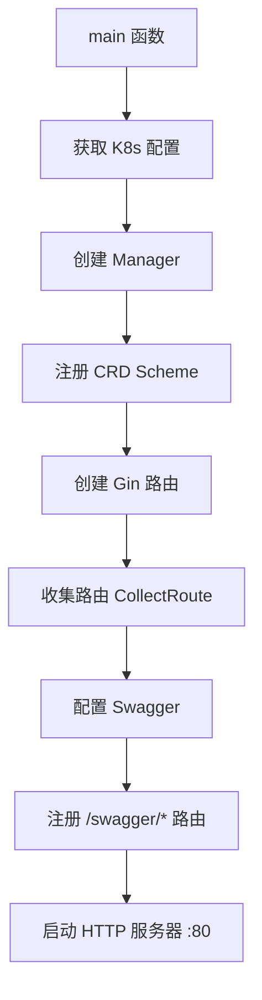

#### 关键组件

1. **Gin 框架**
   - 使用 `gin.Default()` 创建路由
   - `routers.CollectRoute(r)` 注册所有 API 路由

2. **Swagger 配置** ([apiserver/main.go:46](../../cmd/apiserver/main.go#L46))
   ```go
   docs.SwaggerInfo.Title = "Swagger Example API"
   docs.SwaggerInfo.BasePath = "/apis/hwameistor.io/v1alpha1"
   ```

3. **服务端口**: `:80` (固定)

**访问 Swagger**: `http://<server>/swagger/index.html`

---

### 8. Failover Assistant

**入口**: [cmd/failover-assistant/main.go:35](../../cmd/failover-assistant/main.go#L35)

#### 启动流程

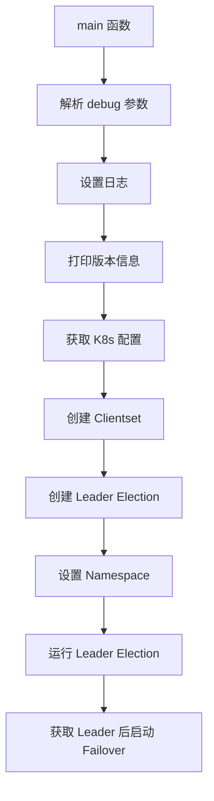

#### 关键特性

- **Leader Election Lock**: `hwameistor-failover-assistant`
- **功能**: 应用自动故障转移到健康节点

#### 命令行参数

```bash
--debug  # 调试模式 (默认: true)
```

---

### 9. Auditor

**入口**: [cmd/auditor/main.go:27](../../cmd/auditor/main.go#L27)

#### 启动流程

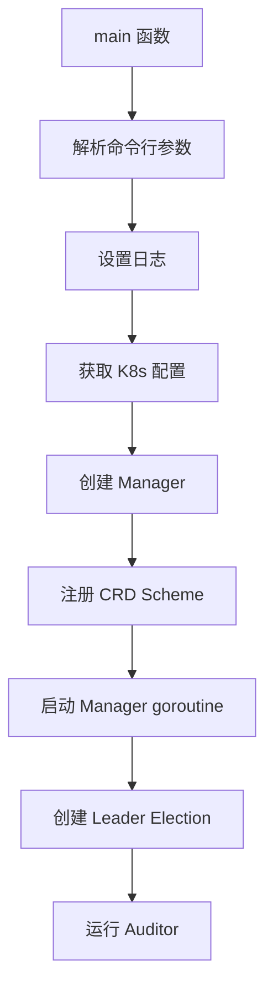

#### 关键特性

- **Leader Election Lock**: `hwameistor-auditor`
- **功能**: 跟踪资源历史记录（集群、节点、存储池、卷）
- **使用 Manager Cache**: `auditor.Run(mgr.GetCache(), stopCh)`

---

### 10. PVC AutoResizer

**入口**: [cmd/pvc-autoresizer/main.go:34](../../cmd/pvc-autoresizer/main.go#L34)

#### 启动流程

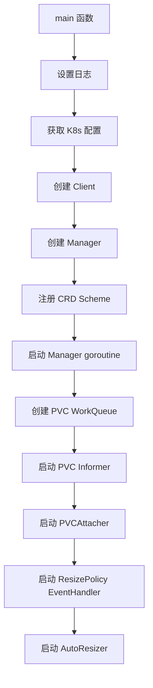

#### 关键组件

1. **PVC WorkQueue** ([pvc-autoresizer/main.go:77](../../cmd/pvc-autoresizer/main.go#L77))
   ```go
   pvcWorkQueue := workqueue.NewNamedRateLimitingQueue(
       workqueue.NewItemExponentialFailureRateLimiter(time.Second, 16*time.Second),
       "pvc-attacher",
   )
   ```

2. **三个并发组件**
   - `PVCAttacher`: 处理 PVC 变化
   - `ResizePolicyEventHandler`: 处理扩容策略事件
   - `AutoResizer`: 自动扩容执行器

---

### 11. Local Disk Action Controller

**入口**: [cmd/local-disk-action-controller/main.go:29](../../cmd/local-disk-action-controller/main.go#L29)

#### 启动流程

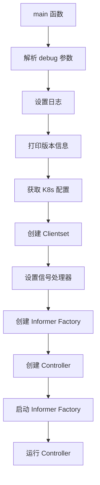

#### 关键特性

- **Informer Factory**: 监听 `LocalDisks` 和 `LocalDiskActions`
- **同步周期**: 30 秒
- **功能**: 处理磁盘操作和动作

---

### 12. hwameictl (CLI 工具)

**入口**: [cmd/hwameictl/hwameictl.go:8](../../cmd/hwameictl/hwameictl.go#L8)

#### 启动流程

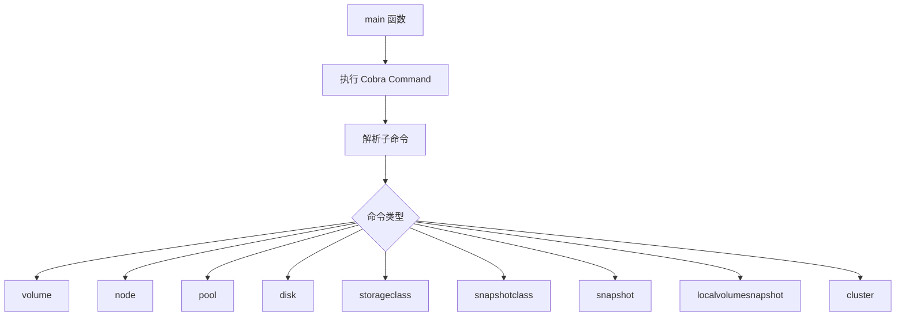

#### 可用子命令

| 子命令 | 功能 | 实现包 |
|-------|------|--------|
| `volume` | 卷管理 | [pkg/hwameictl/cmdparser/volume](../../pkg/hwameictl/cmdparser/volume/) |
| `node` | 节点管理 | [pkg/hwameictl/cmdparser/node](../../pkg/hwameictl/cmdparser/node/) |
| `pool` | 存储池管理 | [pkg/hwameictl/cmdparser/pool](../../pkg/hwameictl/cmdparser/pool/) |
| `disk` | 磁盘管理 | [pkg/hwameictl/cmdparser/disk](../../pkg/hwameictl/cmdparser/disk/) |
| `storageclass` | StorageClass 管理 | [pkg/hwameictl/cmdparser/storageclass](../../pkg/hwameictl/cmdparser/storageclass/) |
| `snapshotclass` | SnapshotClass 管理 | [pkg/hwameictl/cmdparser/snapshotclass](../../pkg/hwameictl/cmdparser/snapshotclass/) |
| `snapshot` | 快照管理 | [pkg/hwameictl/cmdparser/snapshot](../../pkg/hwameictl/cmdparser/snapshot/) |
| `localvolumesnapshot` | 本地卷快照管理 | [pkg/hwameictl/cmdparser/localvolumesnapshot](../../pkg/hwameictl/cmdparser/localvolumesnapshot/) |
| `cluster` | 集群管理 | [pkg/hwameictl/cmdparser/cluster](../../pkg/hwameictl/cmdparser/cluster/) |

#### 全局参数

```bash
--debug             # 启用调试模式 (默认: false)
--kubeconfig        # 指定 kubeconfig 文件 (默认: ~/.kube/config)
--timeout           # 请求超时时间 (默认: 3s)
```

**使用示例**:
```bash
hwameictl volume list
hwameictl node get <node-name>
hwameictl disk list --node <node-name>
```

---

## 通用启动流程模式

### 模式一：Controller-Runtime Manager (最常用)

适用于: LDM, LS, Auditor, PVC AutoResizer

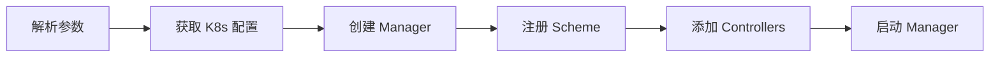

### 模式二：Leader Election + Controller

适用于: Evictor, Failover Assistant


### 模式三：HTTP/HTTPS Server

适用于: API Server, Admission Controller

```mermaid
flowchart LR
    A[解析参数] --> B[创建路由]
    B --> C[注册 Handlers]
    C --> D[配置中间件]
    D --> E[启动 HTTP(S) 服务器]
```

### 模式四：Informer Factory

适用于: Local Disk Action Controller


---

## 核心依赖初始化总结

### 日志初始化

所有模块都使用 `logrus` 作为日志库：

```go
func setupLogging() {
    log.SetLevel(log.Level(*logLevel))
    log.SetFormatter(&log.JSONFormatter{
        CallerPrettyfier: func(f *runtime.Frame) (string, string) {
            s := strings.Split(f.Function, ".")
            funcName := s[len(s)-1]
            fileName := path.Base(f.File)
            return funcName, fmt.Sprintf("%s:%d", fileName, f.Line)
        }
    })
    log.SetReportCaller(true)
}
```

### Kubernetes 配置加载

统一使用 `sigs.k8s.io/controller-runtime/pkg/client/config`:

```go
cfg, err := config.GetConfig()
```

配置优先级：
1. `KUBECONFIG` 环境变量
2. `~/.kube/config` 文件
3. In-Cluster 配置 (Pod 内运行时)

### CRD Scheme 注册

```go
if err := v1alpha1.AddToScheme(mgr.GetScheme()); err != nil {
    log.WithError(err).Error("Failed to setup scheme")
    os.Exit(1)
}
```

### 信号处理

```go
stopCh := signals.SetupSignalHandler()
```

监听信号：
- `SIGTERM`
- `SIGINT`

---

## 启动顺序建议

在 Kubernetes 集群中部署时，推荐的启动顺序：

1. **Local Disk Manager** (基础磁盘管理)
2. **Local Storage** (卷管理)
3. **Scheduler** (调度器)
4. **Admission Controller** (准入控制)
5. **API Server** (可选，UI/API 访问)
6. **Exporter** (可选，监控)
7. **Evictor** (可选，驱逐处理)
8. **Failover Assistant** (可选，故障转移)
9. **Auditor** (可选，审计)
10. **PVC AutoResizer** (可选，自动扩容)
11. **Local Disk Action Controller** (可选，磁盘操作)

**核心模块**: 1-4 是必须的，其他为增强功能。

---

## 调试技巧

### 查看版本信息

所有支持版本信息的模块都会在启动时打印：

```
GitCommit:"<commit>", BuildDate:"<date>", GoVersion:"<version>"
```

通过构建时注入：

```bash
-ldflags "-X main.BUILDVERSION=${GIT_COMMIT} -X main.BUILDTIME=${BUILD_TIME} -X main.GOVERSION=${GO_VERSION}"
```

### 启用调试日志

大多数模块支持 `--v` 或 `--debug` 参数：

```bash
# 使用 --v 参数 (logrus level)
--v=5  # Trace level

# 使用 --debug 参数
--debug=true
```

### 本地运行模块

#### API Server 本地运行

```bash
make apiserver_run
# 访问 http://127.0.0.1/swagger/index.html
```

#### CLI 工具本地运行

```bash
# 编译
make build_hwameictl OS=linux ARCH=amd64

# 运行
./_build/hwameictl/hwameictl-linux-amd64 --help
```

---

## 总结

HwameiStor 采用模块化设计，每个模块独立启动和运行：

- **核心存储模块**: LDM + LS 提供磁盘和卷管理
- **调度集成**: Scheduler + Admission 集成 Kubernetes 调度
- **管理工具**: API Server + hwameictl 提供管理接口
- **高级特性**: Evictor, Failover, AutoResizer 提供企业级功能
- **可观测性**: Exporter + Auditor 提供监控和审计

所有模块遵循统一的启动模式，便于理解和维护。

---

*文档生成时间: 2025-10-02*
*适用版本: v1.0.0+*
