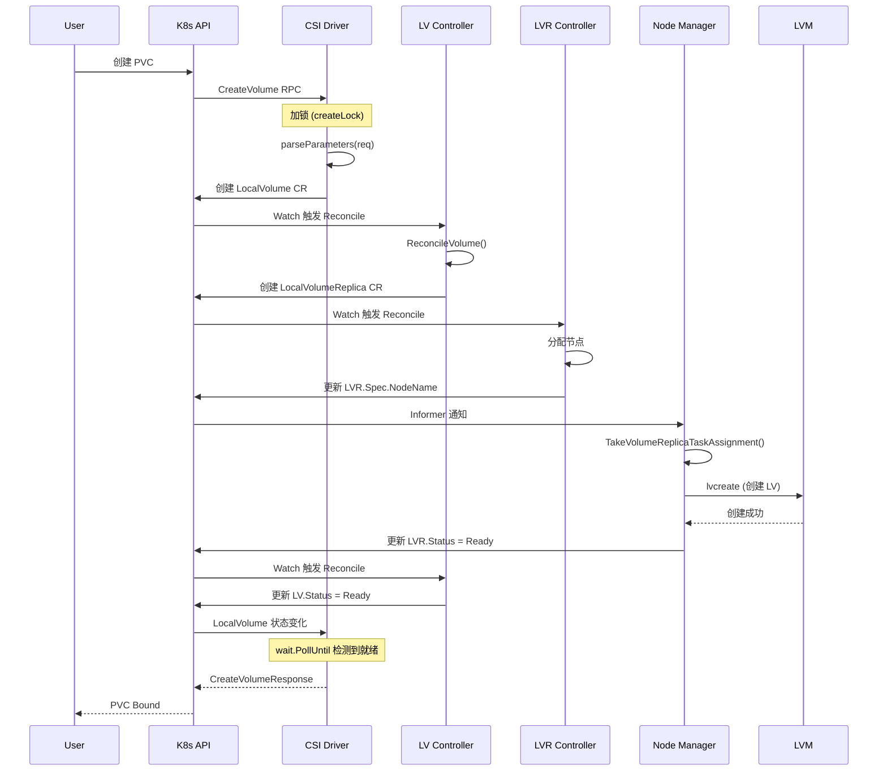
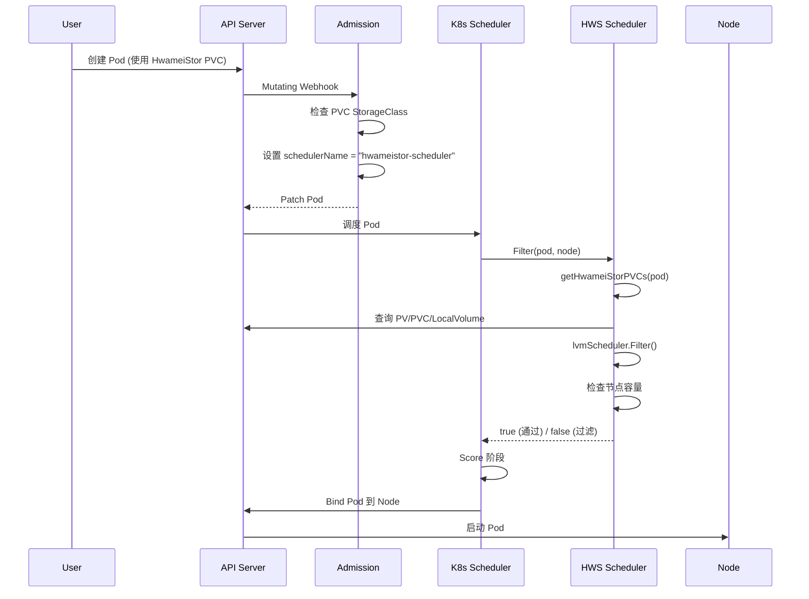
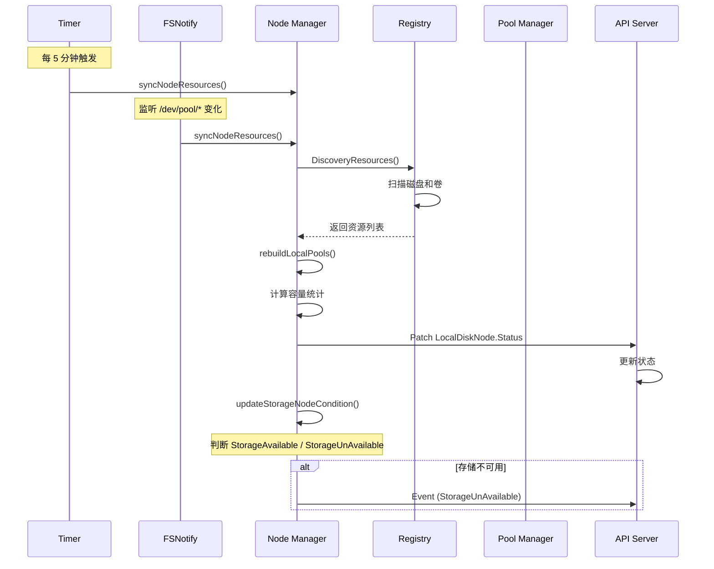

# HwameiStor 核心调用链

本文档详细描述 HwameiStor 各模块的核心函数调用链，帮助理解代码执行流程。

---

## 1. Local Disk Manager (LDM) 调用链

### 1.1 启动调用链

```
main()
├─ [cmd/local-disk-manager/diskmanager.go:58]
│  解析命令行参数并初始化日志
│
├─ config.GetConfig()
│  获取 Kubernetes 集群配置
│
├─ newClusterManager(cfg)
│  [cmd/local-disk-manager/diskmanager.go:326]
│  创建集群级别 Manager，管理 CRD Controller
│  ├─ manager.New(cfg, options)
│  │  创建 controller-runtime Manager
│  ├─ v1alpha1.AddToScheme(mgr.GetScheme())
│  │  注册 HwameiStor CRD Scheme
│  ├─ setIndexField(mgr.GetCache())
│  │  [cmd/local-disk-manager/diskmanager.go:389]
│  │  设置 Cache 索引字段（spec.nodeName, spec.devicePath）
│  └─ controller.AddToManager(mgr)
│     添加所有 Cluster Controllers
│
├─ newNodeManager(cfg)
│  [cmd/local-disk-manager/diskmanager.go:357]
│  创建节点级别 Manager，管理节点资源
│  └─ controller.AddToNodeManager(mgr)
│     添加所有 Node Controllers
│
├─ startClusterComponents(stopCh, clusterMgr) [goroutine]
│  [cmd/local-disk-manager/diskmanager.go:154]
│  ├─ utils.RunWithLease(...)
│  │  启动 Leader Election
│  ├─ startClusterController(ctx, mgr) [goroutine]
│  │  [cmd/local-disk-manager/diskmanager.go:175]
│  │  └─ mgr.Start(ctx)
│  │     启动 Cluster Controller Manager
│  └─ startNodeClusterManager(ctx, mgr) [goroutine]
│     [cmd/local-disk-manager/diskmanager.go:204]
│     └─ mc.NewManager(...).Start(ctx)
│        启动 Node Cluster Manager
│
└─ startNodeComponents(stopCh, nodeMgr) [goroutine]
   [cmd/local-disk-manager/diskmanager.go:131]
   └─ utils.RunWithLease(...)
      启动 Node Lease Election
      ├─ startNodeController(ctx, mgr) [goroutine]
      │  [cmd/local-disk-manager/diskmanager.go:167]
      │  └─ mgr.Start(ctx)
      │     启动 Node Controller Manager
      │
      ├─ startNodeManager(ctx, mgr) [goroutine]
      │  [cmd/local-disk-manager/diskmanager.go:184]
      │  └─ node.NewManager(...).Start(ctx)
      │     [pkg/local-disk-manager/member/node/manager.go:122]
      │     核心节点资源管理器
      │
      ├─ disk.NewController(mgr).StartMonitor() [goroutine]
      │  启动磁盘监控
      │
      ├─ smart.NewCollector().StartTimerCollect(ctx) [goroutine]
      │  启动 SMART 数据采集（每 6 小时）
      │
      └─ csidriver.NewDiskDriver(csiCfg).Run() [goroutine, 可选]
         启动 Disk CSI Driver
```

### 1.2 Node Manager 启动详细调用链

```
node.NewManager(options).Start(ctx)
├─ [pkg/local-disk-manager/member/node/manager.go:214]
│  节点资源管理器入口
│
├─ setupInformers()
│  [pkg/local-disk-manager/member/node/manager.go:242]
│  设置 Informer 监听 CR 变化
│  ├─ LocalDisk Informer
│  │  ├─ handleLocalDiskAdd → diskTaskQueue.Add()
│  │  ├─ handleLocalDiskUpdate → diskTaskQueue.Add()
│  │  └─ handleLocalDiskDelete → diskTaskQueue.Add()
│  ├─ LocalDiskClaim Informer
│  │  ├─ handleLocalDiskClaimAdd → diskClaimTaskQueue.Add()
│  │  ├─ handleLocalDiskClaimUpdate → diskClaimTaskQueue.Add()
│  │  └─ handleLocalDiskClaimDelete → diskClaimTaskQueue.Add()
│  └─ LocalDiskNode Informer
│     └─ handleLocalDiskNodeDelete → 重建节点 CR
│
├─ poolManager.Init()
│  初始化存储池管理器
│
├─ register()
│  [pkg/local-disk-manager/member/node/manager.go:458]
│  注册/更新 LocalDiskNode CR
│
├─ startPoolEventsWatcher(ctx) [goroutine]
│  [pkg/local-disk-manager/member/node/manager.go:486]
│  监听存储池文件系统事件（fsnotify）
│  └─ 触发 syncNodeResources()
│
├─ startTimerSyncWorker(ctx) [goroutine]
│  [pkg/local-disk-manager/member/node/manager.go:474]
│  定时同步节点资源（每 5 分钟）
│  └─ wait.Until(syncNodeResources, duration, stopCh)
│
├─ startDiskTaskWorker(ctx) [goroutine]
│  处理 LocalDisk 任务队列
│  └─ 处理磁盘创建/更新/删除
│
├─ startDiskClaimTaskWorker(ctx) [goroutine]
│  处理 LocalDiskClaim 任务队列
│  └─ 处理磁盘声明绑定
│
└─ startDiskNodeTaskWorker(ctx) [goroutine]
   处理 LocalDiskNode 任务队列
```

### 1.3 节点资源同步调用链

```
syncNodeResources()
├─ [pkg/local-disk-manager/member/node/manager.go:346]
│  同步节点资源到 API Server
│
├─ discoveryNodeResources()
│  [pkg/local-disk-manager/member/node/manager.go:276]
│  └─ registryManager.DiscoveryResources()
│     发现节点上的磁盘和卷
│
├─ rebuildLocalPools()
│  [pkg/local-disk-manager/member/node/manager.go:291]
│  重建本地存储池状态
│  ├─ registryManager.ListVolumesByType(devType)
│  │  按设备类型列出卷
│  ├─ registryManager.ListDisksByType(devType)
│  │  按设备类型列出磁盘
│  └─ 计算容量统计（总容量、已用容量、空闲容量）
│
└─ k8sClient.Status().Patch(...)
   更新 LocalDiskNode.Status
   └─ updateStorageNodeCondition(diskNodeNew)
      [pkg/local-disk-manager/member/node/manager.go:393]
      更新节点状态条件（StorageAvailable/StorageUnAvailable）
```

**关键分支**:
- ⚠️ **错误处理**: 所有同步失败会记录日志，定时器会持续重试
- 🔄 **并发**: 5 个 goroutine 并发运行（定时器、文件监听、3 个任务队列）
- 🔐 **Leader Election**: Cluster 和 Node 组件分别使用独立的 Lease 选举

---

## 2. Local Storage (LS) 调用链

### 2.1 启动调用链

```
main()
├─ [cmd/local-storage/storage.go:86]
│  解析参数并验证（nodename, csi-address, namespace）
│
├─ getSystemConfig()
│  [cmd/local-storage/storage.go:226]
│  获取系统配置（DRBD 模式、端口、数据同步工具）
│
├─ config.GetConfig()
│  获取 Kubernetes 配置
│
├─ manager.New(cfg, options)
│  创建 controller-runtime Manager
│  ├─ apisv1alpha1.AddToScheme(mgr.GetScheme())
│  ├─ setIndexField(mgr.GetCache())
│  │  设置 LocalVolumeSnapshot 索引（spec.sourceVolume）
│  └─ controller.AddToManager(mgr)
│     添加所有 Controllers
│
├─ member.Member().ConfigureXXX()
│  [pkg/local-storage/member/member.go:69-122]
│  配置 Storage Member（建造者模式）
│  ├─ ConfigureBase(nodeName, namespace, systemConfig, ...)
│  │  [member.go:69] 配置基础信息
│  ├─ ConfigureNode(scheme)
│  │  [member.go:83] 创建 Node Manager
│  │  └─ localnode.New(...)
│  ├─ ConfigureController(scheme)
│  │  [member.go:95] 创建 Controller Manager
│  │  └─ localctrl.New(...)
│  ├─ ConfigureCSIDriver(driverName, sockAddr)
│  │  [member.go:107] 创建 CSI Driver
│  │  └─ localcsi.New(...)
│  └─ ConfigureRESTServer(httpPort)
│     [member.go:116] 创建 REST Server
│     └─ localrest.New(...)
│
└─ utils.RunWithLease(...)
   [cmd/local-storage/storage.go:204]
   启动 Node Lease Heartbeat
   ├─ mgr.Start(stopCtx) [goroutine]
   │  启动 Controller Manager
   └─ storageMember.Run(stopCh)
      [pkg/local-storage/member/member.go:124]
      启动所有组件
      ├─ nodeManager.Run(stopCh) [goroutine]
      ├─ controller.Run(stopCh) [goroutine]
      ├─ csiDriver.Run(stopCh) [goroutine]
      └─ restServer.Run(stopCh) [goroutine]
```

### 2.2 CSI CreateVolume 调用链（核心）

```
CSI CreateVolume RPC
├─ [pkg/local-storage/member/csi/controller.go:53]
│  CSI 控制器创建卷入口
│
├─ createLock.Lock()
│  🔐 全局锁，确保卷创建串行化
│
├─ 特殊场景分支
│  ├─ restoreVolumeFromSnapshot(ctx, req)
│  │  从快照恢复卷
│  └─ cloneVolume(ctx, req)
│     克隆卷
│
├─ apiClient.Get(ctx, ..., &volume)
│  检查卷是否已存在
│
├─ createEmptyVolumeFromRequest(ctx, req)
│  [controller.go:131] 创建新卷
│  ├─ parseParameters(req)
│  │  解析 StorageClass 参数
│  │  ├─ replicaNumber（副本数）
│  │  ├─ poolClass（存储池类型）
│  │  ├─ volumeKind（卷类型：LVM）
│  │  ├─ convertible（是否可转换）
│  │  └─ accessibility（节点亲和性）
│  │
│  ├─ getLocalVolumeGroupOrCreate(req, params)
│  │  获取或创建 LocalVolumeGroup
│  │
│  ├─ 创建 LocalVolume CR
│  │  └─ apiClient.Create(ctx, localVolume)
│  │
│  └─ ⚠️ 错误处理: 如果创建失败返回 InvalidArgument
│
└─ wait.PollUntil(RetryInterval, checkFunc, ctx.Done())
   轮询等待卷就绪（每 1 秒检查一次）
   ├─ apiClient.Get(ctx, ..., &volume)
   │  获取卷状态
   ├─ volume.Status.State == VolumeStateReady?
   │  检查卷是否就绪
   └─ 返回卷信息（VolumeId, CapacityBytes, VolumeContext）
```

**关键分支**:
- 🔄 **并发控制**: `createLock` 保证同一时刻只能创建一个卷
- ⏱️ **超时处理**: `wait.PollUntil` 直到 context 超时或卷就绪
- ⚠️ **错误码**: 使用 gRPC status codes (Internal, InvalidArgument, Unavailable)

### 2.3 LocalVolume Controller Reconcile 调用链

```
Reconcile(ctx, request)
├─ [pkg/local-storage/controller/localvolume/localvolume_controller.go:98]
│  LocalVolume 控制器协调入口
│
├─ client.Get(ctx, request.NamespacedName, &instance)
│  获取 LocalVolume 实例
│  └─ ⚠️ NotFound → 返回 (无需重新入队)
│
├─ storageMember.Controller().ReconcileVolume(instance)
│  [localvolume_controller.go:114]
│  集群级别协调：分配副本到节点
│  └─ [pkg/local-storage/member/controller/manager.go]
│     Controller Manager 处理卷分配逻辑
│
└─ storageMember.Node().TakeVolumeReplicaTaskAssignment(instance)
   [localvolume_controller.go:117]
   节点级别任务：创建本地卷副本
   └─ [pkg/local-storage/member/node/manager.go]
      Node Manager 处理卷副本创建
```

**Reconcile 触发时机**:
1. LocalVolume CR 创建/更新/删除
2. LocalVolumeReplica CR 变化 (通过 EnqueueRequestsFromMapFunc 映射)

---

## 3. Scheduler 调用链

### 3.1 调度器初始化

```
NewScheduler(framework.Handle)
├─ [pkg/scheduler/scheduler/scheduler.go:40]
│  创建 HwameiStor 调度器实例
│
├─ rest.InClusterConfig()
│  获取集群配置
│
├─ manager.New(cfg, options)
│  创建 Manager（用于 Informer Cache）
│  ├─ v1alpha1.AddToScheme(mgr.GetScheme())
│  │  注册 HwameiStor CRD
│  └─ snapshot.AddToScheme(mgr.GetScheme())
│     注册 Snapshot CRD
│
├─ mgr.Start(ctx) [goroutine]
│  启动 Manager 同步 Cache
│
├─ lvmscheduler.New(apiClient, cache, 1000)
│  创建 LVM 副本调度器
│  └─ replicaScheduler.Init()
│     初始化副本调度算法
│
├─ NewLVMVolumeScheduler(...)
│  创建 LVM 卷调度器
│
└─ NewDiskVolumeScheduler(...)
   创建 Disk 卷调度器
```

### 3.2 Filter 调用链（核心调度逻辑）

```
Filter(pod, node)
├─ [pkg/scheduler/scheduler/scheduler.go:107]
│  过滤节点是否适合 Pod 调度
│
├─ getHwameiStorPVCs(pod)
│  获取 Pod 使用的 HwameiStor PVC
│  ├─ 解析 Pod.Spec.Volumes
│  ├─ 查询 PVC (pvcLister.Get)
│  ├─ 查询 StorageClass (scLister.Get)
│  └─ 分类 PVC：
│     ├─ lvmProvisionedPVCs（已分配的 LVM PVC）
│     ├─ lvmNewPVCs（待分配的 LVM PVC）
│     ├─ diskProvisionedPVCs（已分配的 Disk PVC）
│     └─ diskNewPVCs（待分配的 Disk PVC）
│
├─ 提取已存在的 LocalVolume
│  └─ pvLister.Get(pvc.Spec.VolumeName)
│     └─ pv.Spec.CSI.VolumeHandle → LocalVolume 名称
│
├─ pvcRecordPodAffinity(affinity, tolerations, lvmNewPVCs)
│  [scheduler.go:165] 记录 Pod 亲和性到 PVC Annotation
│  └─ apiClient.Patch(...)
│     写入 "hwameistor.io/affinity-annotations"
│
├─ lvmScheduler.Filter(existingLocalVolumes, lvmNewPVCs, node)
│  [scheduler.go:134] LVM 卷调度过滤
│  └─ 检查节点是否有足够容量和副本槽位
│
├─ diskScheduler.Filter(existingLocalVolumes, diskNewPVCs, node)
│  [scheduler.go:155] Disk 卷调度过滤
│  └─ 检查节点是否有可用磁盘
│
└─ 返回 (canSchedule, error)
   ├─ true → 节点通过过滤
   └─ false → 节点被过滤掉
```

**调度策略**:
- 已分配卷的 Pod 必须调度到卷所在节点
- 新卷需要检查节点容量和可用性
- 支持 Pod 亲和性和容忍度传递到卷调度

---

## 4. API Server 调用链

### 4.1 路由注册

```
main()
├─ [cmd/apiserver/main.go:18]
│
├─ gin.Default()
│  创建 Gin 路由引擎
│
├─ routers.CollectRoute(r)
│  [pkg/apiserver/router/router.go]
│  收集所有路由
│  ├─ /apis/hwameistor.io/v1alpha1/
│  │  ├─ /nodes → NodeController
│  │  ├─ /volumes → VolumeController
│  │  ├─ /disks → DiskController
│  │  ├─ /pools → PoolController
│  │  └─ ...
│  └─ 注册 Controller Handlers
│
├─ 配置 Swagger
│  ├─ docs.SwaggerInfo.Title
│  ├─ docs.SwaggerInfo.BasePath
│  └─ r.GET("/swagger/*any", ginSwagger.WrapHandler(...))
│
└─ r.Run(":80")
   启动 HTTP 服务器
```

### 4.2 API 请求处理示例（获取节点列表）

```
GET /apis/hwameistor.io/v1alpha1/nodes
├─ Gin Router 匹配路由
│
├─ NodeController.ListNodes(c *gin.Context)
│  [pkg/apiserver/controller/node_controller.go]
│  ├─ 解析查询参数（page, pageSize, nodeName, state）
│  ├─ apiClient.List(ctx, &nodeList, listOptions)
│  │  查询 LocalStorageNode CR
│  ├─ 过滤和分页
│  └─ c.JSON(http.StatusOK, response)
│     返回 JSON 响应
│
└─ Swagger 文档自动生成
   通过 swag 注释生成 API 文档
```

---

## 5. Admission Controller 调用链

### 5.1 Webhook 处理

```
Mutating Webhook Request
├─ POST /mutate
│  [cmd/admission/app/mutate.go]
│
├─ RegisterHwameiStorMutateWebhooks(options)
│  注册 Webhook Handler
│
├─ mutatePods(ar v1.AdmissionReview)
│  Pod Mutating Webhook 处理函数
│  ├─ 解析 AdmissionRequest
│  ├─ json.Unmarshal(ar.Request.Object.Raw, &pod)
│  │  反序列化 Pod 对象
│  │
│  ├─ 检查 Pod 是否使用 HwameiStor 卷
│  │  └─ 遍历 pod.Spec.Volumes → PVC → StorageClass
│  │     └─ sc.Provisioner == "lvm.hwameistor.io" 或 "disk.hwameistor.io"
│  │
│  ├─ 创建 JSONPatch
│  │  └─ pod.Spec.SchedulerName = "hwameistor-scheduler"
│  │     强制使用 HwameiStor 调度器
│  │
│  └─ AdmissionResponse
│     ├─ Allowed: true
│     ├─ Patch: base64(patchBytes)
│     └─ PatchType: JSONPatch
│
└─ 返回 AdmissionReview 响应
```

**Webhook 触发条件**:
- Pod CREATE/UPDATE 操作
- Pod 使用 HwameiStor StorageClass 的 PVC

---

## 6. 通用调用模式总结

### 6.1 Controller-Runtime Reconcile 模式

```
Controller Reconcile Loop
├─ Watch CR 变化（Informer）
│  └─ 触发 Reconcile(ctx, request)
│
├─ Reconcile 函数
│  ├─ client.Get(ctx, request.NamespacedName, &instance)
│  │  获取 CR 实例
│  │  └─ ⚠️ NotFound → 返回（对象已删除）
│  │
│  ├─ 业务逻辑处理
│  │  ├─ 状态检查
│  │  ├─ 子资源创建/更新
│  │  └─ 外部系统调用
│  │
│  ├─ 更新状态
│  │  └─ client.Status().Update(ctx, instance)
│  │
│  └─ 返回 (reconcile.Result, error)
│     ├─ error != nil → 重新入队
│     ├─ Result.Requeue = true → 重新入队
│     └─ Result.RequeueAfter > 0 → 延迟重新入队
│
└─ 错误重试机制
   └─ 指数退避重试（controller-runtime 内置）
```

### 6.2 Leader Election 模式

```
Leader Election
├─ leaderelection.NewLeaderElection(clientset, lockName, runFunc)
│  创建 Leader Election 实例
│
├─ le.WithNamespace(namespace)
│  设置 Lease 所在 Namespace
│
├─ le.Run()
│  启动选举
│  ├─ 创建/更新 Lease 对象
│  ├─ 竞选 Leader
│  │  └─ 定期续约（心跳）
│  │
│  └─ 获得 Leader 后执行 runFunc(ctx)
│     └─ 失去 Leader 时停止 runFunc
│
└─ 锁名称
   ├─ hwameistor-volume-evictor
   ├─ hwameistor-failover-assistant
   ├─ hwameistor-auditor
   ├─ hwameistor-local-disk-manager-master
   └─ hwameistor-local-disk-manager-worker-<nodeid>
```

### 6.3 Informer + WorkQueue 模式

```
Informer + WorkQueue
├─ Informer 监听 CR 变化
│  ├─ AddFunc(obj)
│  │  └─ workQueue.Add(key)
│  ├─ UpdateFunc(oldObj, newObj)
│  │  └─ workQueue.Add(key)
│  └─ DeleteFunc(obj)
│     └─ workQueue.Add(key)
│
├─ Worker Goroutine
│  └─ wait.Until(runWorker, time.Second, stopCh)
│     └─ for processNextWorkItem() { }
│        ├─ key := workQueue.Get()
│        ├─ defer workQueue.Done(key)
│        │
│        ├─ syncHandler(key)
│        │  处理业务逻辑
│        │  └─ ⚠️ 错误处理
│        │     └─ workQueue.AddRateLimited(key)
│        │
│        └─ workQueue.Forget(key)
│           成功处理后移除限速
│
└─ 优势
   ├─ 解耦事件触发和处理
   ├─ 限速和重试
   └─ 批量处理
```

---

## 7. 核心调用链时序图

### 7.1 卷创建完整流程



### 7.2 Pod 调度流程



### 7.3 节点资源同步流程



---

## 8. 关键函数快速索引

### 8.1 LDM 关键函数

| 函数 | 文件路径 | 作用 |
|------|---------|------|
| `main()` | [cmd/local-disk-manager/diskmanager.go:58](../../cmd/local-disk-manager/diskmanager.go#L58) | 程序入口 |
| `newClusterManager()` | [cmd/local-disk-manager/diskmanager.go:326](../../cmd/local-disk-manager/diskmanager.go#L326) | 创建集群 Manager |
| `newNodeManager()` | [cmd/local-disk-manager/diskmanager.go:357](../../cmd/local-disk-manager/diskmanager.go#L357) | 创建节点 Manager |
| `node.NewManager()` | [pkg/local-disk-manager/member/node/manager.go:122](../../pkg/local-disk-manager/member/node/manager.go#L122) | 节点资源管理器 |
| `Start()` | [pkg/local-disk-manager/member/node/manager.go:214](../../pkg/local-disk-manager/member/node/manager.go#L214) | 启动节点管理器 |
| `setupInformers()` | [pkg/local-disk-manager/member/node/manager.go:242](../../pkg/local-disk-manager/member/node/manager.go#L242) | 设置 Informer |
| `syncNodeResources()` | [pkg/local-disk-manager/member/node/manager.go:346](../../pkg/local-disk-manager/member/node/manager.go#L346) | 同步节点资源 |
| `rebuildLocalPools()` | [pkg/local-disk-manager/member/node/manager.go:291](../../pkg/local-disk-manager/member/node/manager.go#L291) | 重建存储池 |

### 8.2 LS 关键函数

| 函数 | 文件路径 | 作用 |
|------|---------|------|
| `main()` | [cmd/local-storage/storage.go:86](../../cmd/local-storage/storage.go#L86) | 程序入口 |
| `Member()` | [pkg/local-storage/member/member.go:26](../../pkg/local-storage/member/member.go#L26) | 获取 Member 单例 |
| `ConfigureBase()` | [pkg/local-storage/member/member.go:69](../../pkg/local-storage/member/member.go#L69) | 配置基础信息 |
| `ConfigureNode()` | [pkg/local-storage/member/member.go:83](../../pkg/local-storage/member/member.go#L83) | 配置 Node Manager |
| `ConfigureController()` | [pkg/local-storage/member/member.go:95](../../pkg/local-storage/member/member.go#L95) | 配置 Controller |
| `ConfigureCSIDriver()` | [pkg/local-storage/member/member.go:107](../../pkg/local-storage/member/member.go#L107) | 配置 CSI Driver |
| `Run()` | [pkg/local-storage/member/member.go:124](../../pkg/local-storage/member/member.go#L124) | 启动所有组件 |
| `CreateVolume()` | [pkg/local-storage/member/csi/controller.go:53](../../pkg/local-storage/member/csi/controller.go#L53) | CSI 创建卷 |
| `Reconcile()` | [pkg/local-storage/controller/localvolume/localvolume_controller.go:98](../../pkg/local-storage/controller/localvolume/localvolume_controller.go#L98) | LocalVolume 协调 |

### 8.3 Scheduler 关键函数

| 函数 | 文件路径 | 作用 |
|------|---------|------|
| `NewScheduler()` | [pkg/scheduler/scheduler/scheduler.go:40](../../pkg/scheduler/scheduler/scheduler.go#L40) | 创建调度器 |
| `Filter()` | [pkg/scheduler/scheduler/scheduler.go:107](../../pkg/scheduler/scheduler/scheduler.go#L107) | 节点过滤 |
| `getHwameiStorPVCs()` | [pkg/scheduler/scheduler/scheduler.go:108](../../pkg/scheduler/scheduler/scheduler.go#L108) | 获取 HwameiStor PVC |
| `pvcRecordPodAffinity()` | [pkg/scheduler/scheduler/scheduler.go:165](../../pkg/scheduler/scheduler/scheduler.go#L165) | 记录 Pod 亲和性 |

### 8.4 Admission 关键函数

| 函数 | 文件路径 | 作用 |
|------|---------|------|
| `main()` | [cmd/admission/admission.go:23](../../cmd/admission/admission.go#L23) | 程序入口 |
| `RegisterHwameiStorMutateWebhooks()` | [cmd/admission/app/mutate.go](../../cmd/admission/app/mutate.go) | 注册 Webhook |
| `mutatePods()` | [cmd/admission/app/mutate.go](../../cmd/admission/app/mutate.go) | Pod Mutating 逻辑 |

---

## 9. 错误处理和重试策略

### 9.1 Controller Reconcile 重试

- **默认重试**: controller-runtime 自动重试
- **指数退避**: 1s, 2s, 4s, 8s, 16s, ...
- **最大重试次数**: 无限制（由 `maxRetries = 0` 控制）

### 9.2 CSI 操作重试

- **CreateVolume**: `wait.PollUntil` 每 1 秒检查卷状态，直到 context 超时
- **DeleteVolume**: 类似的轮询机制

### 9.3 WorkQueue 限速

```go
workQueue := common.NewTaskQueue("LocalDiskTask", maxRetries)
// 内部使用 workqueue.NewNamedRateLimitingQueue
// 限速策略: ItemExponentialFailureRateLimiter
```

---

## 10. 并发和锁

### 10.1 全局锁

- **CSI CreateVolume**: `createLock sync.Mutex` - 串行化卷创建
- **Node Manager**: `lock sync.RWMutex` - 保护存储池状态

### 10.2 Goroutine 并发

- **LDM Node Manager**: 5 个 goroutine
  - Timer Sync Worker
  - Pool Events Watcher
  - Disk Task Worker
  - Disk Claim Task Worker
  - Disk Node Task Worker

- **LS Member**: 4 个 goroutine
  - Node Manager
  - Controller
  - CSI Driver
  - REST Server

### 10.3 Leader Election

- **Cluster 组件**: 单 Leader（通过 Lease 选举）
- **Node 组件**: 每个节点独立 Lease

---

## 总结

HwameiStor 的调用链遵循以下模式：

1. **Controller-Runtime 模式**: Informer → Reconcile → 业务逻辑 → 更新状态
2. **CSI 模式**: gRPC RPC → 创建 CR → 轮询等待 → 返回响应
3. **调度器模式**: K8s Filter 扩展 → 查询资源 → 容量检查 → 返回结果
4. **Webhook 模式**: HTTP POST → 解析请求 → 修改对象 → 返回 Patch

核心设计思想：
- **声明式 API**: 通过 CR 描述期望状态
- **控制器协调**: Controller 不断协调实际状态向期望状态收敛
- **异步处理**: 使用 WorkQueue 和 Informer 解耦事件和处理
- **高可用**: Leader Election 保证组件单点运行

---

*文档生成时间: 2025-10-02*
*适用版本: v1.0.0+*
