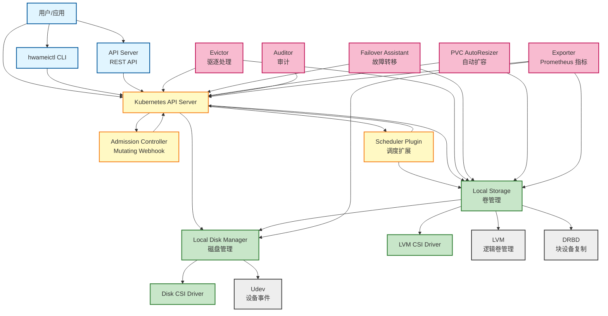
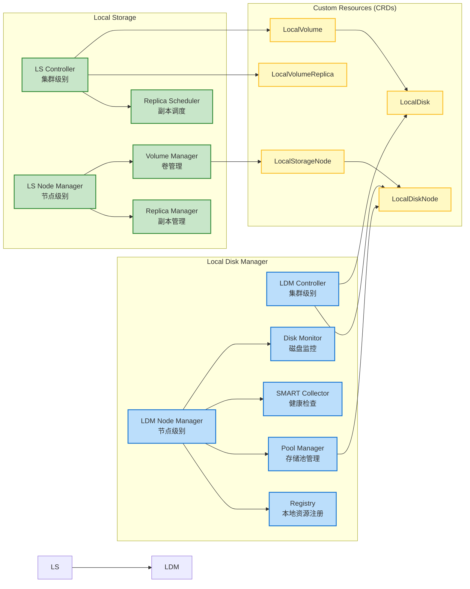
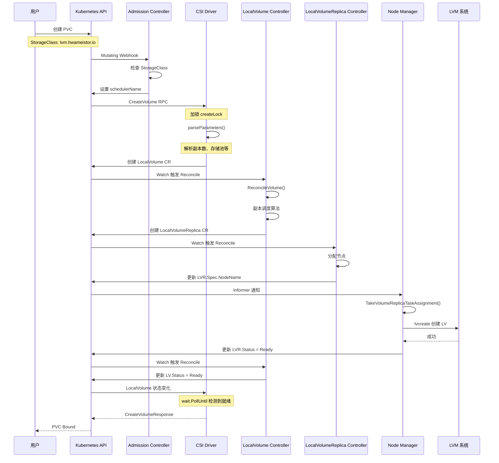
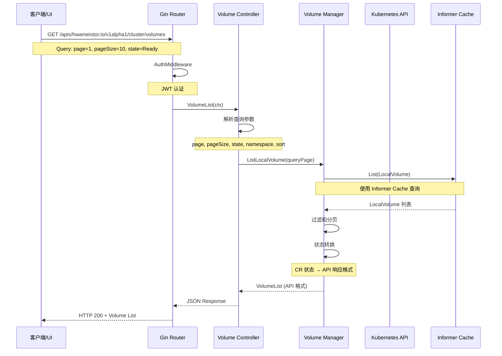
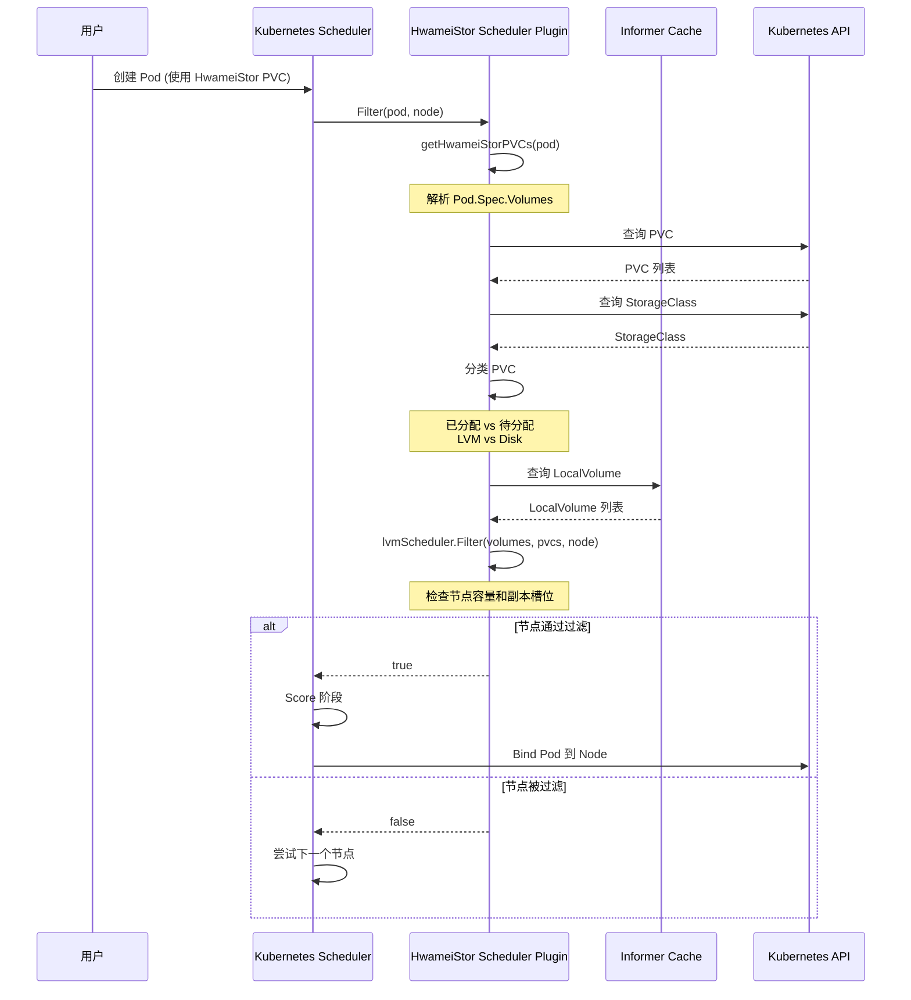
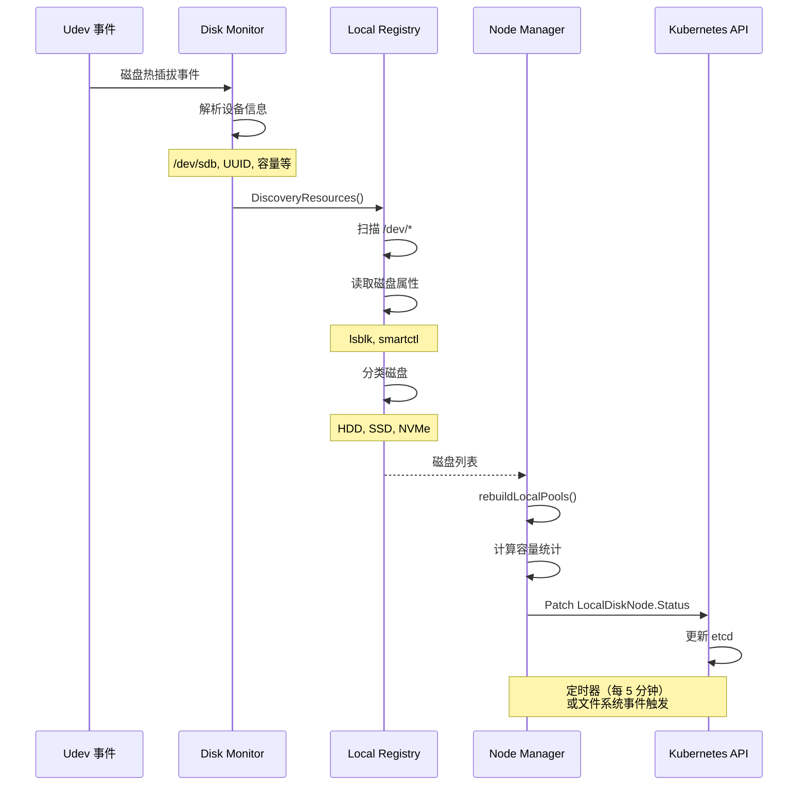

# HwameiStor 模块依赖与数据流

本文档描述 HwameiStor 的模块依赖关系、核心数据结构、典型请求处理流程和 API 接口。

---

## 1. 模块依赖关系图

### 1.1 整体架构依赖



### 1.2 核心模块详细依赖



---

## 2. 核心数据结构

### 2.1 LocalVolume (卷)

**文件**: [pkg/apis/hwameistor/v1alpha1/localvolume_types.go](../../pkg/apis/hwameistor/v1alpha1/localvolume_types.go)

**职责**: 描述逻辑卷的期望状态和实际状态

```go
type LocalVolume struct {
    metav1.TypeMeta   `json:",inline"`
    metav1.ObjectMeta `json:"metadata,omitempty"`

    Spec   LocalVolumeSpec   `json:"spec,omitempty"`
    Status LocalVolumeStatus `json:"status,omitempty"`
}
```

#### LocalVolumeSpec

| 字段 | 类型 | 说明 |
|------|------|------|
| `RequiredCapacityBytes` | int64 | 请求的卷容量（字节），最小 4MB |
| `ReplicaNumber` | int64 | 副本数量：1=非HA，2=HA，4=迁移中（临时） |
| `Convertible` | bool | 是否可从非 HA 转换为 HA |
| `PoolName` | string | 存储池名称（HDD/SSD/NVMe） |
| `Accessibility` | AccessibilityTopology | 拓扑要求（节点、区域、地域） |
| `PersistentVolumeClaimName` | string | 关联的 PVC 名称 |
| `VolumeGroup` | string | 卷组名称（用于调度和分配） |
| `Config` | *VolumeConfig | 卷配置（副本配置） |
| `VolumeQoS` | VolumeQoS | QoS 配置（IOPS、吞吐量） |
| `VolumeEncrypt` | VolumeEncrypt | 加密配置（LUKS） |

#### LocalVolumeStatus

| 字段 | 类型 | 说明 |
|------|------|------|
| `State` | State | 卷状态：Creating, Ready, NotReady, ToBeDeleted 等 |
| `AllocatedCapacityBytes` | int64 | 实际分配的容量 |
| `Replicas` | []string | 副本 CR 名称列表 |
| `PublishedNodeName` | string | 卷被挂载的节点 |
| `PublishedRawBlock` | bool | 是否以裸块设备挂载 |

### 2.2 LocalDisk (磁盘)

**文件**: [pkg/apis/hwameistor/v1alpha1/localdisk_types.go](../../pkg/apis/hwameistor/v1alpha1/localdisk_types.go)

**职责**: 描述物理磁盘的属性和状态

```go
type LocalDisk struct {
    metav1.TypeMeta   `json:",inline"`
    metav1.ObjectMeta `json:"metadata,omitempty"`

    Spec   LocalDiskSpec   `json:"spec,omitempty"`
    Status LocalDiskStatus `json:"status,omitempty"`
}
```

#### LocalDiskSpec

| 字段 | 类型 | 说明 |
|------|------|------|
| `NodeName` | string | 磁盘所在节点 |
| `DevicePath` | string | 设备路径（如 /dev/sdb） |
| `UUID` | string | 磁盘全局唯一标识符 |
| `Capacity` | int64 | 磁盘容量（字节） |
| `HasPartition` | bool | 是否有分区 |
| `PartitionInfo` | []PartitionInfo | 分区信息 |
| `HasRAID` | bool | 是否为 RAID 磁盘 |
| `RAIDInfo` | RAIDInfo | RAID 信息 |
| `HasSmartInfo` | bool | 是否有 SMART 信息 |
| `SmartInfo` | SmartInfo | SMART 健康信息 |
| `DiskAttributes` | DiskAttributes | 磁盘属性（厂商、型号、序列号等） |

#### LocalDiskStatus

| 字段 | 类型 | 说明 |
|------|------|------|
| `State` | LocalDiskState | 磁盘状态：Available, Bound, Pending |
| `ClaimState` | LocalDiskClaimState | 声明状态：Unclaimed, Claimed, Released |

### 2.3 LocalStorageNode (存储节点)

**文件**: [pkg/apis/hwameistor/v1alpha1/localstoragenode_types.go](../../pkg/apis/hwameistor/v1alpha1/localstoragenode_types.go)

**职责**: 描述节点的存储资源和状态

```go
type LocalStorageNode struct {
    metav1.TypeMeta   `json:",inline"`
    metav1.ObjectMeta `json:"metadata,omitempty"`

    Spec   LocalStorageNodeSpec   `json:"spec,omitempty"`
    Status LocalStorageNodeStatus `json:"status,omitempty"`
}
```

#### LocalStorageNodeStatus

| 字段 | 类型 | 说明 |
|------|------|------|
| `Pools` | map[string]LocalPool | 存储池映射（HDD_POOL, SSD_POOL, NVMe_POOL） |
| `State` | State | 节点状态：New, Active, Inactive, Failed |
| `Conditions` | []StorageNodeCondition | 状态条件（Available, UnAvailable, Progressing） |

#### LocalPool (存储池)

| 字段 | 类型 | 说明 |
|------|------|------|
| `Class` | string | 存储类别：HDD, SSD, NVMe |
| `Type` | string | 池类型：REGULAR |
| `TotalCapacityBytes` | int64 | 总容量 |
| `UsedCapacityBytes` | int64 | 已用容量 |
| `FreeCapacityBytes` | int64 | 空闲容量 |
| `VolumeCapacityBytesLimit` | int64 | 单个卷容量上限 |
| `TotalVolumeCount` | int64 | 总卷数 |
| `UsedVolumeCount` | int64 | 已用卷数 |
| `FreeVolumeCount` | int64 | 空闲卷数 |
| `Disks` | []LocalDevice | 磁盘列表 |
| `Volumes` | []string | 卷名称列表 |

### 2.4 LocalVolumeReplica (卷副本)

**文件**: [pkg/apis/hwameistor/v1alpha1/localvolumereplica_types.go](../../pkg/apis/hwameistor/v1alpha1/localvolumereplica_types.go)

**职责**: 描述单个卷副本的状态和配置

#### LocalVolumeReplicaSpec

| 字段 | 类型 | 说明 |
|------|------|------|
| `VolumeName` | string | 所属卷名称 |
| `PoolName` | string | 存储池名称 |
| `NodeName` | string | 副本所在节点 |
| `RequiredCapacityBytes` | int64 | 请求容量 |
| `Delete` | bool | 是否待删除 |

#### LocalVolumeReplicaStatus

| 字段 | 类型 | 说明 |
|------|------|------|
| `State` | State | 副本状态：Creating, Ready, NotReady, Syncing 等 |
| `AllocatedCapacityBytes` | int64 | 实际分配容量 |
| `DevicePath` | string | 设备路径（如 /dev/vg/lv） |
| `StoragePath` | string | 存储路径 |
| `Synced` | bool | 是否同步完成（HA 卷） |

### 2.5 VolumeConfig (卷配置)

**职责**: 控制器和节点之间的配置同步

```go
type VolumeConfig struct {
    Version               int               // 配置版本号
    VolumeName            string            // 卷名称
    RequiredCapacityBytes int64             // 容量
    Convertible           bool              // 是否可转换
    ResourceID            int               // DRBD 资源 ID (-1 表示非 HA)
    ReadyToInitialize     bool              // 是否准备初始化
    Initialized           bool              // 是否已初始化
    Replicas              []VolumeReplica   // 副本配置列表
}
```

### 2.6 关键接口定义

#### LocalStorageMember (LS Member 接口)

**文件**: [pkg/apis/hwameistor/local_storage_member.go](../../pkg/apis/hwameistor/local_storage_member.go)

```go
type LocalStorageMember interface {
    // 配置方法（建造者模式）
    ConfigureBase(name, namespace string, systemConfig v1alpha1.SystemConfig,
                  pvMetadataSize int, cli client.Client, cache cache.Cache,
                  recorder record.EventRecorder) LocalStorageMember
    ConfigureNode(scheme *runtime.Scheme) LocalStorageMember
    ConfigureController(scheme *runtime.Scheme) LocalStorageMember
    ConfigureCSIDriver(driverName, sockAddr string) LocalStorageMember
    ConfigureRESTServer(httpPort int) LocalStorageMember

    // 运行方法
    Run(stopCh <-chan struct{})

    // 访问器方法
    Controller() ControllerManager
    Node() NodeManager
    Name() string
    Version() string
    DriverName() string
}
```

#### NodeManager (节点管理器接口)

```go
type NodeManager interface {
    // 运行节点管理器
    Run(stopCh <-chan struct{})

    // 处理卷副本任务
    TakeVolumeReplicaTaskAssignment(vol *v1alpha1.LocalVolume)

    // 获取节点信息
    GetNodeInfo() *NodeInfo
}
```

---

## 3. 典型请求处理流程

### 3.1 卷创建流程（PVC → Volume）



**数据流**:
1. **输入**: PVC YAML (Kubernetes API)
2. **处理层**:
   - Admission Controller (Webhook) → 修改 Pod.Spec.SchedulerName
   - CSI Driver (gRPC) → 创建 LocalVolume CR
   - LocalVolume Controller (Reconcile) → 创建 LocalVolumeReplica CR
   - Node Manager (TaskQueue) → 调用 LVM 创建逻辑卷
3. **存储**:
   - Kubernetes etcd (CR 状态)
   - 节点本地磁盘 (LVM 逻辑卷)

### 3.2 API 请求处理流程（REST API）



**数据流**:
1. **输入**: HTTP GET Request
   - Path: `/apis/hwameistor.io/v1alpha1/cluster/volumes`
   - Query: `page=1&pageSize=10&state=Ready`
2. **处理层**:
   - Gin Router → 路由匹配
   - AuthMiddleware → JWT 认证
   - VolumeController → 参数解析和验证
   - VolumeManager → 业务逻辑（查询、过滤、分页）
   - Informer Cache → 高效查询 CR
3. **返回**: JSON 响应（VolumeList 结构）

### 3.3 调度流程（Pod Scheduling）



**数据流**:
1. **输入**: Pod Spec (使用 HwameiStor PVC)
2. **处理层**:
   - Kubernetes Scheduler → 触发 Filter 扩展点
   - HwameiStor Scheduler Plugin → 解析 PVC 和 StorageClass
   - LVM Scheduler → 容量和位置检查
   - Disk Scheduler → 磁盘可用性检查
3. **返回**: bool (节点是否适合调度)

### 3.4 磁盘发现流程（Disk Discovery）



**数据流**:
1. **输入**: Udev 设备事件
2. **处理层**:
   - Disk Monitor → 监听 udev 事件
   - Local Registry → 扫描和分类磁盘
   - Node Manager → 构建存储池状态
3. **存储**: LocalDiskNode.Status (Kubernetes CR)

---

## 4. API 接口列表

### 4.1 认证接口

| 路径 | 方法 | 入参 | 出参 | 中间件 | 说明 |
|------|------|------|------|--------|------|
| `/cluster/auth/auth` | POST | `AuthReqBody{username, password}` | `AuthRspBody{token}` | - | 用户登录 |
| `/cluster/auth/logout` | POST | - | - | Auth | 用户登出 |
| `/cluster/auth/info` | GET | - | `UserInfo` | Auth | 获取用户信息 |

### 4.2 集群状态接口

| 路径 | 方法 | 入参 | 出参 | 中间件 | 说明 |
|------|------|------|------|--------|------|
| `/cluster/status` | GET | - | `ClusterStatus` | Auth | 获取集群状态 |
| `/cluster/operations` | GET | - | `OperationList` | Auth | 获取操作列表 |
| `/cluster/operations/:operationName` | GET | `operationName` | `Operation` | Auth | 获取单个操作 |
| `/cluster/events` | GET | - | `EventList` | Auth | 获取事件列表 |
| `/cluster/events/:eventName` | GET | `eventName` | `Event` | Auth | 获取单个事件 |

### 4.3 卷管理接口

| 路径 | 方法 | 入参 | 出参 | 中间件 | 说明 |
|------|------|------|------|--------|------|
| `/cluster/volumes` | GET | `QueryPage{page, pageSize, volumeName, state, namespace, sortBy, sortDir, group}` | `VolumeList` | Auth | 获取卷列表 |
| `/cluster/volumes/:volumeName` | GET | `volumeName` | `Volume` | Auth | 获取单个卷 |
| `/cluster/volumes/:volumeName/replicas` | GET | `volumeName, volumeReplicaName, state` | `VolumeReplicaList` | Auth | 获取卷副本列表 |
| `/cluster/volumes/:volumeName/migrate` | POST | `VolumeMigrateReqBody{srcNode, selectedNode, replicaAffinity, abort}` | `VolumeMigrateRspBody` | Auth | 卷迁移操作 |
| `/cluster/volumes/:volumeName/convert` | POST | `VolumeConvertReqBody{replicaNumber}` | `VolumeConvertRspBody` | Auth | 卷转换操作（非 HA → HA） |
| `/cluster/volumes/:volumeName/expand` | POST | `VolumeExpandReqBody{targetCapacity}` | `VolumeExpandRspBody` | Auth | 卷扩容操作 |
| `/cluster/volumes/:volumeName/operations` | GET | `volumeName` | `OperationList` | Auth | 获取卷操作历史 |
| `/cluster/volumes/:volumeName/events` | GET | `volumeName` | `EventList` | Auth | 获取卷事件 |
| `/cluster/volumes/:volumeName/snapshot` | GET | `volumeName` | `SnapshotList` | Auth | 获取卷快照列表 |

### 4.4 卷组接口

| 路径 | 方法 | 入参 | 出参 | 中间件 | 说明 |
|------|------|------|------|--------|------|
| `/cluster/volumegroups` | GET | - | `VolumeGroupList` | Auth | 获取卷组列表 |
| `/cluster/volumegroups/:vgName` | GET | `vgName` | `VolumeGroup` | Auth | 获取单个卷组 |

### 4.5 快照接口

| 路径 | 方法 | 入参 | 出参 | 中间件 | 说明 |
|------|------|------|------|--------|------|
| `/cluster/snapshots` | GET | - | `SnapshotList` | Auth | 获取快照列表 |
| `/cluster/snapshot/:snapshotName/snapshot` | GET | `snapshotName` | `Snapshot` | Auth | 获取单个快照 |

### 4.6 节点接口

| 路径 | 方法 | 入参 | 出参 | 中间件 | 说明 |
|------|------|------|------|--------|------|
| `/cluster/nodes` | GET | `QueryPage{page, pageSize, nodeName, state}` | `StorageNodeList` | Auth | 获取存储节点列表 |
| `/cluster/nodes/:nodeName` | GET | `nodeName` | `StorageNode` | Auth | 获取单个存储节点 |
| `/cluster/nodes/:nodeName` | POST | `nodeName, StorageNodeUpdateReqBody` | `StorageNode` | Auth | 更新存储节点 |
| `/cluster/nodes/:nodeName/migrates` | GET | `nodeName` | `MigrateList` | Auth | 获取节点迁移任务 |
| `/cluster/nodes/:nodeName/disks` | GET | `nodeName` | `DiskList` | Auth | 获取节点磁盘列表 |
| `/cluster/nodes/:nodeName/disks/:diskName` | GET | `nodeName, diskName` | `Disk` | Auth | 获取单个磁盘 |
| `/cluster/nodes/:nodeName/disks/:devicePath` | POST | `nodeName, devicePath, DiskUpdateReqBody` | `Disk` | Auth | 更新磁盘 |
| `/cluster/nodes/:nodeName/disks/:devicePath/owner` | POST | `nodeName, devicePath, DiskOwnerReqBody` | `Disk` | Auth | 设置磁盘所有者 |

### 4.7 存储池接口

| 路径 | 方法 | 入参 | 出参 | 中间件 | 说明 |
|------|------|------|------|--------|------|
| `/cluster/nodes/:nodeName/pools` | GET | `nodeName` | `PoolList` | Auth | 获取节点存储池列表 |
| `/cluster/nodes/:nodeName/pools/:poolName` | GET | `nodeName, poolName` | `Pool` | Auth | 获取单个存储池 |
| `/cluster/nodes/:nodeName/pools/:poolName/disks` | GET | `nodeName, poolName` | `DiskList` | Auth | 获取存储池磁盘列表 |
| `/cluster/pools` | GET | - | `PoolList` | Auth | 获取所有存储池 |
| `/cluster/pools/:poolName` | GET | `poolName` | `Pool` | Auth | 获取单个存储池 |
| `/cluster/pools/:poolName/nodes` | GET | `poolName` | `NodeList` | Auth | 获取存储池节点列表 |
| `/cluster/pools/expand` | POST | `PoolExpandReqBody{nodeName, diskName, poolName}` | `PoolExpandRspBody` | Auth | 扩展存储池 |

### 4.8 磁盘接口

| 路径 | 方法 | 入参 | 出参 | 中间件 | 说明 |
|------|------|------|------|--------|------|
| `/cluster/localdisks` | GET | `QueryPage{page, pageSize, nodeName, state}` | `LocalDiskList` | Auth | 获取本地磁盘列表 |
| `/cluster/localdisknodes` | GET | `QueryPage{page, pageSize, nodeName}` | `LocalDiskNodeList` | Auth | 获取磁盘节点列表 |

### 4.9 设置接口

| 路径 | 方法 | 入参 | 出参 | 中间件 | 说明 |
|------|------|------|------|--------|------|
| `/cluster/drbd` | GET | - | `DRBDSetting` | Auth | 获取 DRBD 设置 |
| `/cluster/drbd` | POST | `DRBDSettingReqBody{enable}` | `DRBDSetting` | Auth | 启用/禁用 DRBD |

### 4.10 请求/响应数据结构示例

#### QueryPage (查询参数)

```go
type QueryPage struct {
    Page              int32  // 页码
    PageSize          int32  // 每页大小
    VolumeName        string // 卷名称（模糊匹配）
    VolumeState       State  // 卷状态
    VolumeReplicaName string // 副本名称
    NameSpace         string // 命名空间
    Sort              string // 排序字段 (time, name, namespace)
    SortDir           string // 排序方向 (ASC, DESC)
    VolumeGroup       string // 卷组名称
}
```

#### VolumeList (响应)

```go
type VolumeList struct {
    Volumes    []Volume // 卷列表
    Page       int32    // 当前页码
    PageSize   int32    // 每页大小
    TotalCount int32    // 总数量
}
```

#### VolumeMigrateReqBody (卷迁移请求)

```go
type VolumeMigrateReqBody struct {
    SrcNode          string // 源节点
    SelectedNode     string // 目标节点（空表示自动选择）
    ReplicaAffinity  bool   // 副本亲和性
    Abort            bool   // 是否中止迁移
}
```

---

## 5. 数据流向总结

### 5.1 写入路径（创建卷）

```
User (PVC YAML)
  ↓
Kubernetes API Server (etcd)
  ↓
Admission Controller (Mutating Webhook)
  ↓
CSI Driver (gRPC CreateVolume)
  ↓
LocalVolume CR (etcd)
  ↓
LocalVolume Controller (Reconcile)
  ↓
LocalVolumeReplica CR (etcd)
  ↓
Node Manager (TaskQueue)
  ↓
LVM (lvcreate)
  ↓
本地磁盘 (块设备)
```

### 5.2 读取路径（查询卷）

```
User (HTTP GET)
  ↓
Gin Router (路由匹配)
  ↓
AuthMiddleware (JWT 验证)
  ↓
VolumeController (参数解析)
  ↓
VolumeManager (业务逻辑)
  ↓
Informer Cache (高效查询)
  ↓
LocalVolume CR (etcd)
  ↓
JSON 响应 (HTTP 200)
```

### 5.3 状态同步路径（磁盘状态）

```
物理磁盘变化
  ↓
Udev 事件
  ↓
Disk Monitor
  ↓
Local Registry (扫描磁盘)
  ↓
Node Manager (重建存储池)
  ↓
LocalDiskNode.Status (etcd)
  ↓
Informer Cache (同步)
  ↓
API Server / Scheduler (查询)
```

---

## 6. 关键设计模式

### 6.1 控制器模式 (Controller Pattern)

- **Watch → Reconcile → Update**
- 通过 Informer 监听 CR 变化
- Reconcile 函数协调期望状态和实际状态
- 使用 WorkQueue 和限速重试

### 6.2 建造者模式 (Builder Pattern)

- **LocalStorageMember 配置**
- 链式调用：`Member().ConfigureBase().ConfigureNode().ConfigureController()`
- 清晰的配置阶段划分

### 6.3 注册表模式 (Registry Pattern)

- **Local Registry**
- 缓存节点本地资源（磁盘、卷）
- 提供快速查询接口

### 6.4 观察者模式 (Observer Pattern)

- **Informer + EventHandler**
- 监听 CR 变化触发回调
- AddFunc, UpdateFunc, DeleteFunc

### 6.5 策略模式 (Strategy Pattern)

- **调度器**
- LVM Scheduler 和 Disk Scheduler
- 不同存储类型使用不同调度策略

---

## 总结

HwameiStor 的模块依赖和数据流设计具有以下特点：

1. **清晰的分层架构**:
   - 用户交互层 (CLI, API Server)
   - Kubernetes 集成层 (Admission, Scheduler)
   - 核心存储层 (LDM, LS)
   - 外部系统层 (LVM, DRBD, Udev)

2. **声明式 API**:
   - 通过 CR 描述期望状态
   - Controller 负责协调实际状态

3. **高效的数据查询**:
   - Informer Cache 减少 API Server 压力
   - 索引字段加速查询

4. **模块化设计**:
   - 每个模块职责单一
   - 通过 CR 和 API 进行模块间通信

5. **可扩展性**:
   - 支持多种存储类型 (HDD, SSD, NVMe)
   - 支持多种部署模式 (HA, 非 HA)
   - 支持多种操作 (迁移、转换、扩容)

---

*文档生成时间: 2025-10-02*
*适用版本: v1.0.0+*
