# HwameiStor 系统架构文档

本文档是 HwameiStor 系统的完整架构说明，整合了项目概览、启动流程、调用链、模块依赖等核心信息。

---

## 目录

- [1. 系统整体架构综述](#1-系统整体架构综述)
- [2. 顶层目录结构](#2-顶层目录结构)
- [3. 系统架构图](#3-系统架构图)
- [4. 启动流程](#4-启动流程)
- [5. 核心调用链](#5-核心调用链)
- [6. 模块依赖关系](#6-模块依赖关系)
- [7. 外部依赖](#7-外部依赖)
- [8. 配置项](#8-配置项)
- [9. 部署架构](#9-部署架构)
- [10. 数据持久化](#10-数据持久化)

---

## 1. 系统整体架构综述

### 1.1 项目简介

**HwameiStor** 是一个 Kubernetes 原生的高可用本地存储系统，专为有状态工作负载设计。它基于 CSI 架构，创建本地存储资源池，管理各种类型的磁盘（HDD、SSD、NVMe），并通过本地卷提供分布式存储服务。

- **项目类型**: CNCF 沙箱项目
- **开发语言**: Go 1.21
- **Kubernetes 兼容性**: 1.24-1.30
- **代码仓库**: github.com/hwameistor/hwameistor
- **许可证**: Apache 2.0

### 1.2 核心特性

1. **自动化磁盘管理**
   - 自动发现和管理节点磁盘
   - SMART 健康监控
   - 磁盘分类（HDD、SSD、NVMe）

2. **高可用存储**
   - 基于 DRBD 的跨节点复制
   - 自动故障转移
   - 数据一致性保证

3. **Kubernetes 原生集成**
   - CSI 标准接口
   - 自定义调度器
   - Admission Webhook 自动配置

4. **灵活的卷管理**
   - 卷扩容
   - 非 HA 卷转换为 HA 卷
   - 卷迁移
   - 快照和克隆

5. **多租户支持**
   - 命名空间隔离
   - 资源配额
   - QoS 支持

6. **可观测性**
   - Prometheus 指标导出
   - 事件和审计日志
   - REST API 和 Web UI

### 1.3 架构原则

- **声明式 API**: 通过 CRD 描述期望状态
- **控制器协调**: Controller 不断协调实际状态向期望状态收敛
- **模块化设计**: 各模块职责单一，松耦合
- **高可用性**: Leader Election 保证组件单点运行
- **可扩展性**: 支持多种存储类型和部署模式

---

## 2. 顶层目录结构

| 目录 | 作用 | 关键文件 |
|------|------|---------|
| **cmd/** | 所有可执行模块的入口 | |
| ├─ [local-disk-manager/](../../cmd/local-disk-manager/) | LDM 模块入口 | `diskmanager.go` |
| ├─ [local-storage/](../../cmd/local-storage/) | LS 模块入口 | `storage.go` |
| ├─ [scheduler/](../../cmd/scheduler/) | 调度器入口 | `scheduler.go` |
| ├─ [admission/](../../cmd/admission/) | 准入控制器入口 | `admission.go` |
| ├─ [evictor/](../../cmd/evictor/) | 驱逐控制器入口 | `main.go` |
| ├─ [exporter/](../../cmd/exporter/) | 指标导出器入口 | `main.go` |
| ├─ [apiserver/](../../cmd/apiserver/) | API 服务器入口 | `main.go` |
| ├─ [failover-assistant/](../../cmd/failover-assistant/) | 故障转移助手入口 | `main.go` |
| ├─ [auditor/](../../cmd/auditor/) | 审计器入口 | `main.go` |
| ├─ [pvc-autoresizer/](../../cmd/pvc-autoresizer/) | PVC 自动扩容器入口 | `main.go` |
| ├─ [local-disk-action-controller/](../../cmd/local-disk-action-controller/) | 磁盘动作控制器入口 | `main.go` |
| └─ [hwameictl/](../../cmd/hwameictl/) | CLI 工具入口 | `hwameictl.go` |
| **pkg/** | 核心业务逻辑 | |
| ├─ [apis/](../../pkg/apis/) | CRD 定义和生成的客户端 | |
| │  ├─ hwameistor/v1alpha1/ | API 类型定义 | `localvolume_types.go`, `localdisk_types.go` |
| │  └─ client/ | 生成的 clientsets, listers, informers | |
| ├─ [local-disk-manager/](../../pkg/local-disk-manager/) | LDM 核心逻辑 | |
| │  ├─ controller/ | 集群级别控制器 | `manager.go` |
| │  ├─ member/ | 节点级别管理器 | `node/manager.go` |
| │  ├─ disk/ | 磁盘发现和管理 | `manager.go` |
| │  ├─ smart/ | SMART 监控 | `collector.go` |
| │  ├─ udev/ | udev 事件处理 | |
| │  └─ csi/ | Disk CSI Driver | `driver/controller.go` |
| ├─ [local-storage/](../../pkg/local-storage/) | LS 核心逻辑 | |
| │  ├─ controller/ | 集群级别控制器 | `localvolume/`, `localvolumereplica/` |
| │  ├─ member/ | 节点级别 Member | `member.go`, `node/`, `controller/` |
| │  └─ csi/ | LVM CSI Driver | `controller.go`, `node.go` |
| ├─ [scheduler/](../../pkg/scheduler/) | 调度器插件 | `scheduler/scheduler.go` |
| ├─ [webhook/](../../pkg/webhook/) | Admission Webhook | `mutate.go` |
| ├─ [evictor/](../../pkg/evictor/) | 驱逐处理逻辑 | `evictor.go` |
| ├─ [exporter/](../../pkg/exporter/) | Prometheus 指标 | `collector.go` |
| ├─ [apiserver/](../../pkg/apiserver/) | REST API 实现 | |
| │  ├─ router/ | 路由定义 | `router.go` |
| │  ├─ controller/ | HTTP 控制器 | `VolumeController.go`, `NodeController.go` |
| │  ├─ manager/ | 业务逻辑 | `hwameistor/` |
| │  └─ api/ | API 数据结构 | `volume.go`, `node.go` |
| ├─ [failover-assistant/](../../pkg/failover-assistant/) | 故障转移逻辑 | `failover.go` |
| ├─ [auditor/](../../pkg/auditor/) | 审计逻辑 | `auditor.go` |
| ├─ [pvc-autoresizer/](../../pkg/pvc-autoresizer/) | 自动扩容逻辑 | `resizer.go` |
| ├─ [hwameictl/](../../pkg/hwameictl/) | CLI 工具实现 | `cmdparser/` |
| └─ [utils/](../../pkg/utils/) | 共享工具库 | - |
| **build/** | Dockerfile 和构建脚本 | |
| ├─ local-disk-manager/ | LDM Dockerfile | `Dockerfile` |
| ├─ local-storage/ | LS Dockerfile | `Dockerfile` |
| └─ ... | 其他模块 Dockerfile | |
| **deploy/** | Kubernetes 部署清单 | |
| └─ crds/ | CRD YAML 定义 | `*.yaml` |
| **helm/** | Helm Chart | |
| └─ hwameistor/ | 主 Chart | `values.yaml`, `templates/` |
| **test/** | 测试代码 | |
| ├─ e2e/ | E2E 测试 | `*.sh` |
| └─ ... | 单元测试 | `*_test.go` |
| **docs/** | 文档 | |
| └─ claude/ | Claude 生成的文档 | `01-overview.md`, `02-entrypoint.md` 等 |
| **vendor/** | 依赖的第三方库 | |
| **Makefile** | 构建和测试脚本 | - |
| **go.mod** | Go 模块依赖 | - |
| **CLAUDE.md** | Claude Code 指引文档 | - |

---

## 3. 系统架构图

### 3.1 分层架构

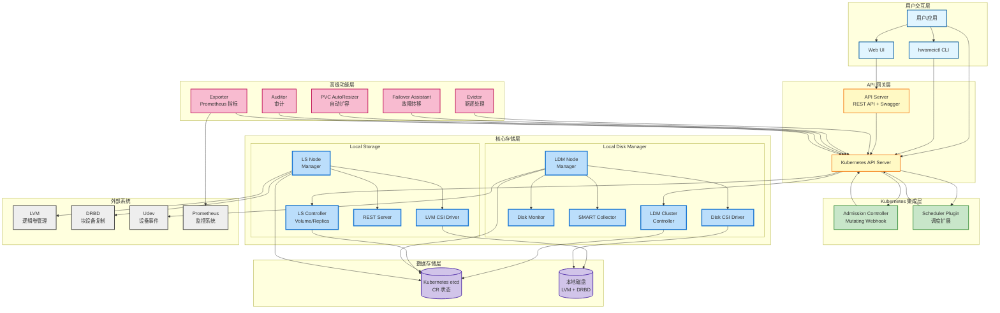

### 3.2 模块交互视图

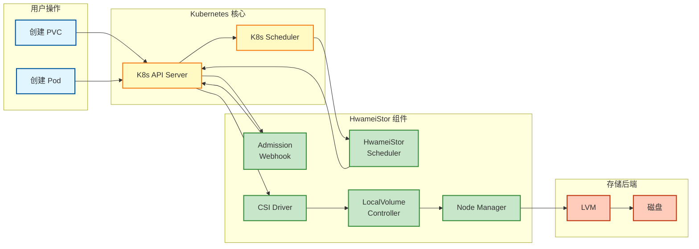

---

## 4. 启动流程

### 4.1 Local Disk Manager 启动流程

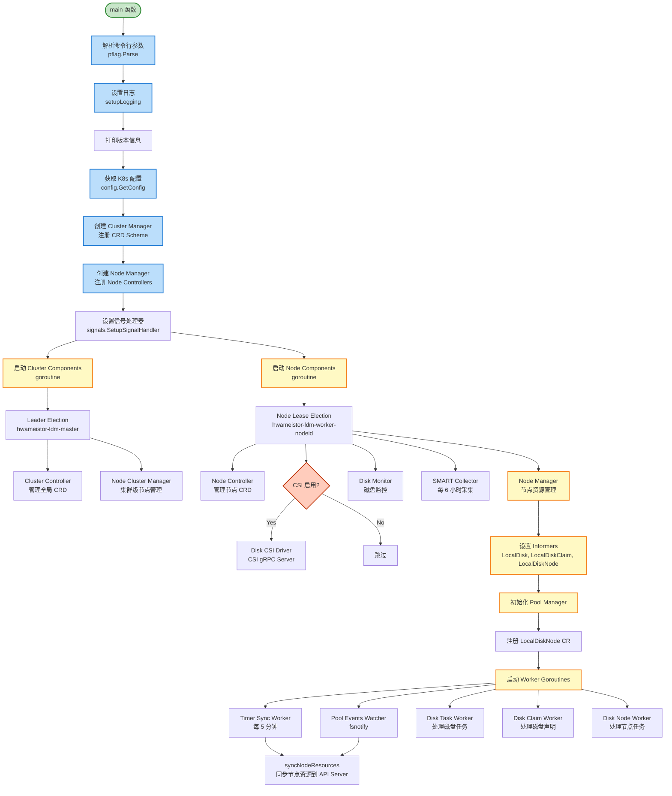

### 4.2 Local Storage 启动流程

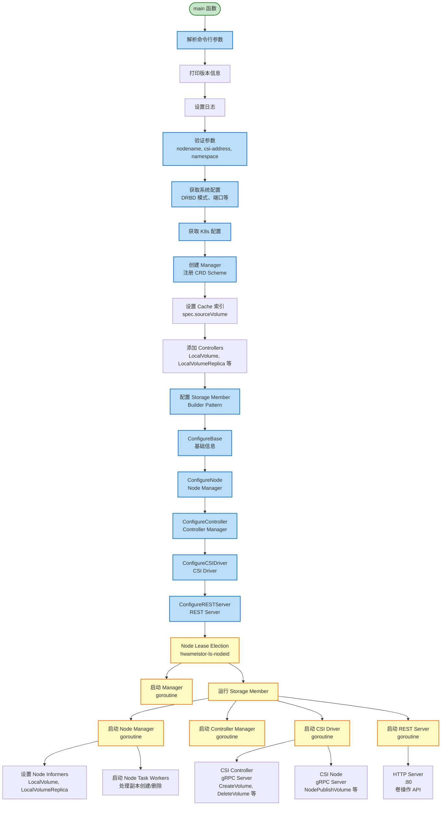

### 4.3 其他组件启动流程

#### Scheduler

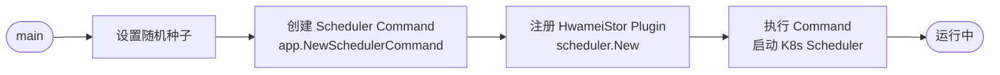

#### Admission Controller

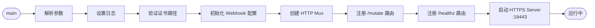

#### API Server

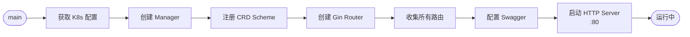

---

## 5. 核心调用链

### 5.1 卷创建完整时序图

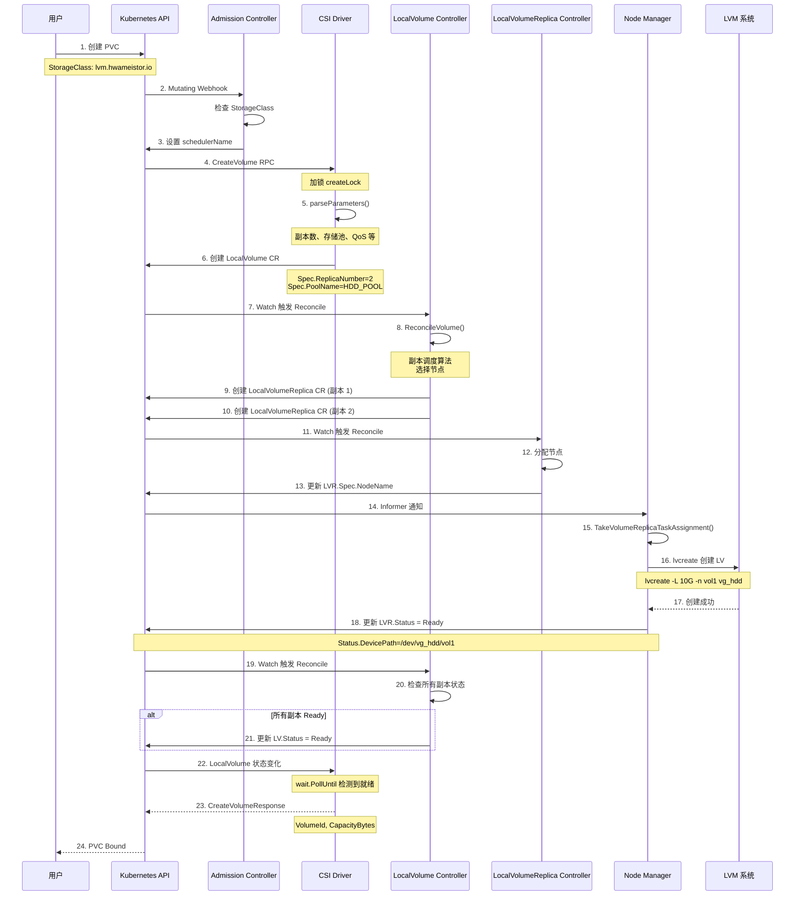

### 5.2 Pod 调度时序图

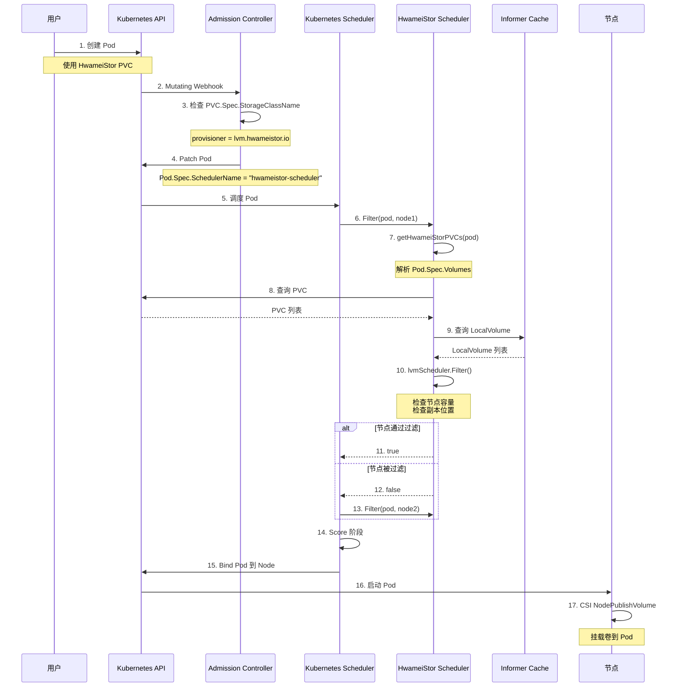

### 5.3 节点资源同步流程

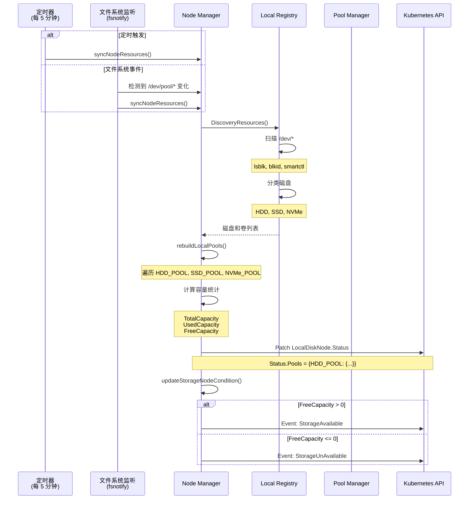

---

## 6. 模块依赖关系

### 6.1 整体依赖关系图

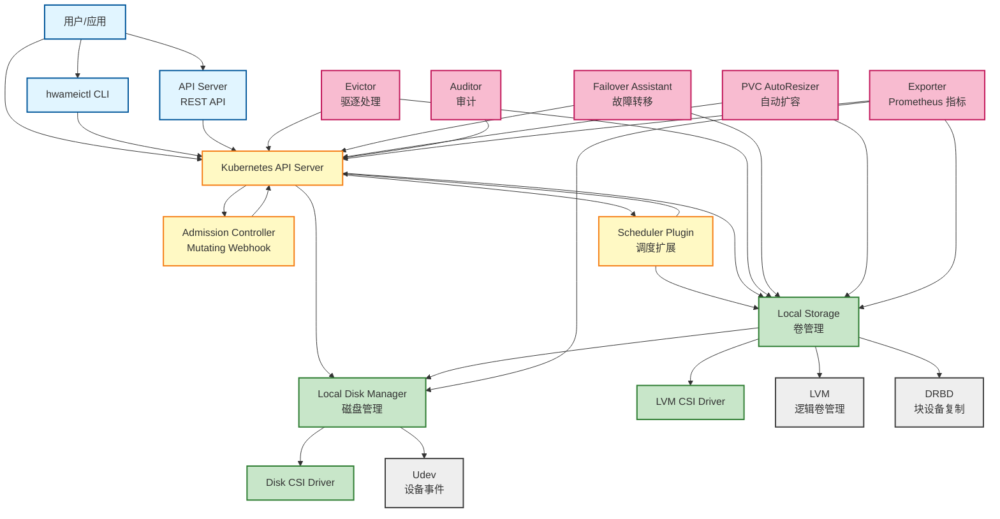

### 6.2 核心模块内部依赖

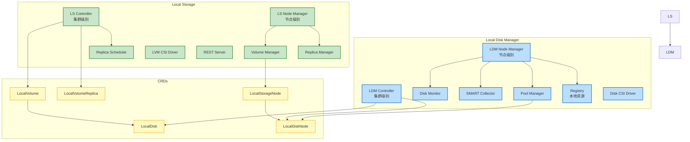

---

## 7. 外部依赖

### 7.1 Kubernetes 生态

| 依赖 | 版本 | 用途 |
|------|------|------|
| **Kubernetes** | 1.24-1.30 | 容器编排平台 |
| **etcd** | - | Kubernetes 存储后端，存储所有 CR 状态 |
| **controller-runtime** | v0.9.2 | Controller 框架，提供 Manager、Reconcile、Cache 等 |
| **client-go** | v12.0.0+ | Kubernetes 客户端库 |
| **CSI Spec** | v1.5.0 | CSI 标准接口定义 |

### 7.2 存储系统

| 依赖 | 版本 | 用途 | 是否必需 |
|------|------|------|---------|
| **LVM2** | - | 逻辑卷管理，创建/删除/扩展卷 | ✅ 必需 |
| **DRBD** | 9.x | 块设备复制，实现 HA 卷 | ⭕ 可选（HA 卷需要） |
| **Udev** | - | 设备事件监听，磁盘热插拔检测 | ✅ 必需 |

### 7.3 监控和日志

| 依赖 | 版本 | 用途 | 是否必需 |
|------|------|------|---------|
| **Prometheus** | - | 指标采集和监控 | ⭕ 可选 |
| **logrus** | v1.9.3 | 结构化日志库 | ✅ 必需 |

### 7.4 Web 框架

| 依赖 | 版本 | 用途 |
|------|------|------|
| **Gin** | v1.8.1 | HTTP 框架，API Server 使用 |
| **Swagger (swag)** | v1.8.7 | API 文档生成 |
| **gin-swagger** | v1.5.3 | Gin 的 Swagger 集成 |

### 7.5 gRPC 和 Protobuf

| 依赖 | 版本 | 用途 |
|------|------|------|
| **gRPC** | v1.40.0 | CSI 驱动的 RPC 框架 |
| **protobuf** | - | 数据序列化 |

### 7.6 CLI 框架

| 依赖 | 版本 | 用途 |
|------|------|------|
| **Cobra** | v1.7.0 | CLI 命令行框架 (hwameictl) |
| **pflag** | v1.0.5 | 命令行参数解析 |

### 7.7 测试框架

| 依赖 | 版本 | 用途 |
|------|------|------|
| **Ginkgo** | v2.1.4 | BDD 测试框架 |
| **Gomega** | v1.19.0 | 断言库 |
| **Testify** | v1.8.4 | 测试工具库 |

### 7.8 系统依赖总结

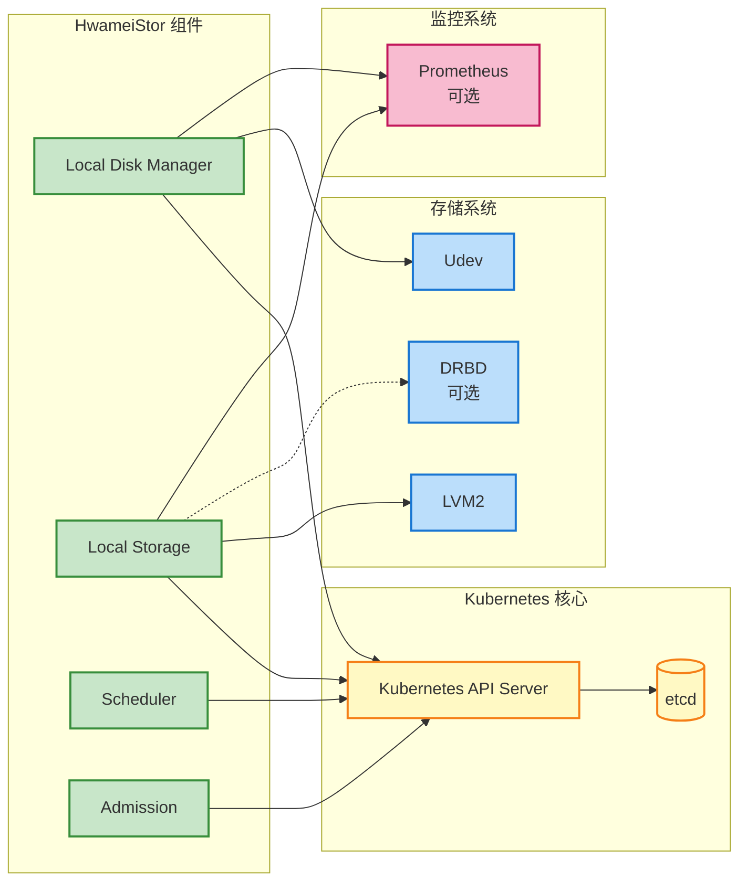

---

## 8. 配置项

### 8.1 Helm Chart 配置 (values.yaml)

#### 全局配置

```yaml
global:
  # 镜像仓库配置
  k8sImageRegistry: registry.k8s.io          # K8s CSI 组件镜像仓库
  hwameistorImageRegistry: ghcr.io           # HwameiStor 组件镜像仓库
  kubeletRootDir: /var/lib/kubelet           # Kubelet 插件目录
```

#### StorageClass 配置

```yaml
storageClass:
  enabled: true                               # 是否创建 StorageClass
  default: false                              # 是否设为默认 StorageClass
  allowVolumeExpansion: true                  # 是否允许卷扩容
  convertible: false                          # 是否支持非 HA → HA 转换
  reclaimPolicy: Retain                       # 回收策略: Retain, Delete
  enableHA: false                             # 是否启用 HA (需要 DRBD)
  diskType: HDD                               # 磁盘类型: HDD, SSD, NVMe
  fsType: xfs                                 # 文件系统类型: xfs, ext4
```

#### Local Disk Manager 配置

```yaml
localDiskManager:
  tolerationsOnMaster: true                   # 是否容忍 Master 节点污点
  enableCSI: true                             # 是否启用 Disk CSI Driver
  manager:
    imageRepository: hwameistor/local-disk-manager
    tag: ""                                   # 镜像标签（空表示使用 Chart 版本）
    resources: {}                             # 资源限制
```

#### Local Storage 配置

```yaml
localStorage:
  tolerationsOnMaster: true
  member:
    config:
      drbdStartPort: 43001                    # DRBD 起始端口
      maxHAVolumeCount: 1000                  # 最大 HA 卷数量
      maxMigrateCount: 1                      # 最大并发迁移数
      snapshotRestoreTimeout: 600             # 快照恢复超时（秒）
    imageRepository: hwameistor/local-storage
    tag: ""
    resources: {}
  migrate:
    juicesync:                                # 数据同步工具
      imageRepository: hwameistor/hwameistor-juicesync
      tag: v1.0.4-01
  hostPaths:
    sshDir: /root/.ssh                        # SSH 密钥目录
    drbdDir: /etc/drbd.d                      # DRBD 配置目录
```

#### Scheduler 配置

```yaml
scheduler:
  replicas: 1
  kubeApiServerConfigFilePath: /etc/kubernetes/admin.conf
  imageRepository: hwameistor/scheduler
  tag: ""
  resources: {}
```

#### Admission Controller 配置

```yaml
admission:
  replicas: 1
  imageRepository: hwameistor/admission
  tag: ""
  resources: {}
  failurePolicy: "Ignore"                     # Webhook 失败策略: Ignore, Fail
```

#### API Server 配置

```yaml
apiserver:
  replicas: 1
  imageRepository: hwameistor/apiserver
  tag: ""
  resources: {}
  auth:
    enableAuth: false                         # 是否启用认证
    accessId: admin                           # 默认用户名
    secretKey: admin                          # 默认密码
```

#### 其他组件配置

```yaml
evictor:
  replicas: 1
  imageRepository: hwameistor/evictor
  tag: ""

failoverAssistant:
  replicas: 1
  imageRepository: hwameistor/failover-assistant
  tag: ""

exporter:
  replicas: 1
  imageRepository: hwameistor/exporter
  tag: ""

auditor:
  replicas: 1
  imageRepository: hwameistor/auditor
  tag: ""

pvcAutoResizer:
  replicas: 1
  imageRepository: hwameistor/pvc-autoresizer
  tag: ""
```

### 8.2 命令行参数

#### Local Disk Manager

```bash
--endpoint=unix://csi/csi.sock              # CSI endpoint
--drivername=disk.hwameistor.io             # CSI driver 名称
--nodeid=<node-name>                        # 节点 ID (必需)
--csi-enable=false                          # 是否启用 CSI Driver
--v=4                                       # 日志级别 (0-5)
```

#### Local Storage

```bash
--nodename=<node-name>                      # 节点名称 (必需)
--namespace=<namespace>                     # Pod 命名空间 (必需)
--csi-address=<socket-path>                 # CSI endpoint (必需)
--system-mode=drbd                          # 系统模式 (drbd)
--data-sync-tool=juicesync                  # 数据同步工具
--drbd-start-port=43001                     # DRBD 起始端口
--max-ha-volume-count=1000                  # 最大 HA 卷数
--http-port=80                              # REST 服务端口
--max-migrate-count=1                       # 最大并发迁移数
--migrate-check=false                       # 启用迁移数据校验
--snapshot-restore-timeout=600              # 快照恢复超时（秒）
--pv-metadata-size=4194304                  # PV 元数据大小（字节，默认 4MB）
--v=4                                       # 日志级别
```

#### hwameictl CLI

```bash
--debug=false                               # 调试模式
--kubeconfig=~/.kube/config                 # kubeconfig 文件路径
--timeout=3s                                # 请求超时时间
```

### 8.3 环境变量

| 环境变量 | 默认值 | 说明 |
|---------|--------|------|
| `KUBECONFIG` | `~/.kube/config` | Kubernetes 配置文件路径 |
| `IMAGE_TAG` | `99.9-dev` | 开发环境镜像标签 |
| `RELEASE_TAG` | - | 发布版本标签 |

---

## 9. 部署架构

### 9.1 Kubernetes 部署模型

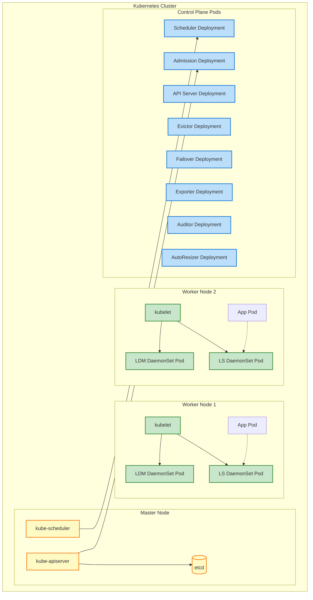

### 9.2 组件部署方式

| 组件 | 部署类型 | 副本数 | 节点选择 |
|------|---------|-------|---------|
| **Local Disk Manager** | DaemonSet | 每节点 1 个 | 所有节点（可容忍 Master 污点） |
| **Local Storage** | DaemonSet | 每节点 1 个 | 所有节点（可容忍 Master 污点） |
| **Scheduler** | Deployment | 1 | 任意节点 |
| **Admission Controller** | Deployment | 1 | 任意节点 |
| **Evictor** | Deployment | 1 (Leader Election) | 任意节点 |
| **Failover Assistant** | Deployment | 1 (Leader Election) | 任意节点 |
| **Auditor** | Deployment | 1 (Leader Election) | 任意节点 |
| **Exporter** | DaemonSet | 每节点 1 个 | 所有节点 |
| **API Server** | Deployment | 1 | 任意节点 |
| **PVC AutoResizer** | Deployment | 1 | 任意节点 |
| **Web UI** | Deployment | 1 | 任意节点 |

### 9.3 网络端口

| 组件 | 端口 | 协议 | 用途 |
|------|------|------|------|
| **LDM CSI Driver** | Unix Socket | gRPC | CSI 接口 |
| **LS CSI Driver** | Unix Socket | gRPC | CSI 接口 |
| **LS REST Server** | 80 | HTTP | 节点内部 REST API |
| **Admission Controller** | 18443 | HTTPS | Webhook 服务 |
| **API Server** | 80 | HTTP | REST API + Swagger |
| **DRBD** | 43001-44000 | TCP | 卷数据同步（HA 卷） |
| **Exporter** | 8383 | HTTP | Prometheus 指标 |

---

## 10. 数据持久化

### 10.1 数据存储位置

```mermaid
graph TB
    subgraph "Kubernetes etcd"
        CRs[Custom Resources<br/>LocalVolume<br/>LocalVolumeReplica<br/>LocalDisk<br/>LocalDiskNode<br/>LocalStorageNode]
    end

    subgraph "节点本地磁盘"
        subgraph "LVM 卷组"
            VG_HDD[VG: vg_hdd]
            VG_SSD[VG: vg_ssd]
            VG_NVMe[VG: vg_nvme]
        end

        subgraph "逻辑卷"
            LV1[LV: vol-1]
            LV2[LV: vol-2]
            LV3[LV: vol-3]
        end

        subgraph "DRBD 资源 (HA 卷)"
            DRBD1[DRBD: r0]
            DRBD2[DRBD: r1]
        end
    end

    subgraph "文件系统"
        Pool[存储池目录<br/>/var/lib/hwameistor/pool]
        PoolHDD[/var/lib/hwameistor/pool/HDD]
        PoolSSD[/var/lib/hwameistor/pool/SSD]
        PoolNVMe[/var/lib/hwameistor/pool/NVMe]
    end

    CRs -.-> VG_HDD
    CRs -.-> VG_SSD
    CRs -.-> VG_NVMe

    VG_HDD --> LV1
    VG_SSD --> LV2
    VG_NVMe --> LV3

    LV1 -.-> DRBD1
    LV2 -.-> DRBD2

    Pool --> PoolHDD
    Pool --> PoolSSD
    Pool --> PoolNVMe

    classDef etcdClass fill:#fff9c4,stroke:#f57f17,stroke-width:2px
    classDef diskClass fill:#c8e6c9,stroke:#388e3c,stroke-width:2px
    classDef fsClass fill:#bbdefb,stroke:#1976d2,stroke-width:2px

    class CRs etcdClass
    class VG_HDD,VG_SSD,VG_NVMe,LV1,LV2,LV3,DRBD1,DRBD2 diskClass
    class Pool,PoolHDD,PoolSSD,PoolNVMe fsClass
```

### 10.2 数据持久化策略

| 数据类型 | 存储位置 | 持久化方式 | 备份/恢复 |
|---------|---------|----------|----------|
| **CR 状态** | Kubernetes etcd | Kubernetes 原生持久化 | etcd 备份/恢复 |
| **卷数据** | 节点本地磁盘 (LVM LV) | 直接写入块设备 | 快照/克隆 |
| **HA 卷数据** | DRBD 复制到多个节点 | 实时同步复制 | 自动故障转移 |
| **磁盘元数据** | LocalDisk CR | etcd | etcd 备份 |
| **节点状态** | LocalStorageNode CR | etcd | 自动重建 |
| **存储池信息** | 文件系统目录 + CR | 文件 + etcd | fsnotify 监听 |

### 10.3 数据保护机制

1. **HA 卷**: DRBD 跨节点实时复制，任一节点故障不丢数据
2. **快照**: 支持卷快照，可恢复到历史状态
3. **克隆**: 支持从快照或卷克隆新卷
4. **回收策略**: 支持 Retain（保留）和 Delete（删除）
5. **状态重建**: 节点重启后自动扫描磁盘，重建状态

---

## 总结

HwameiStor 是一个功能完整、架构清晰的 Kubernetes 原生本地存储系统：

### 核心优势

1. **Kubernetes 原生**
   - 完全遵循 Kubernetes 设计哲学
   - 声明式 API 和控制器模式
   - 标准 CSI 接口

2. **高可用性**
   - DRBD 跨节点复制
   - 自动故障转移
   - Leader Election 保证单点运行

3. **易用性**
   - 自动磁盘发现和管理
   - Admission Webhook 自动配置
   - 丰富的 CLI 和 REST API

4. **可扩展性**
   - 支持多种磁盘类型
   - 灵活的卷管理（扩容、转换、迁移）
   - 模块化设计，易于扩展

5. **可观测性**
   - Prometheus 指标导出
   - 完整的事件和审计日志
   - Web UI 和 Swagger API 文档

### 技术栈

- **语言**: Go 1.21
- **框架**: controller-runtime, Gin, Cobra
- **存储**: LVM, DRBD
- **接口**: CSI, REST API
- **部署**: Kubernetes (DaemonSet, Deployment), Helm

### 适用场景

- 需要本地存储高性能的有状态应用
- 需要高可用保证的关键业务
- 边缘计算场景（本地存储优于远程存储）
- 成本敏感的场景（无需购买专用存储设备）

---

*文档生成时间: 2025-10-02*
*适用版本: v1.0.0+*
*维护者: HwameiStor 社区*
